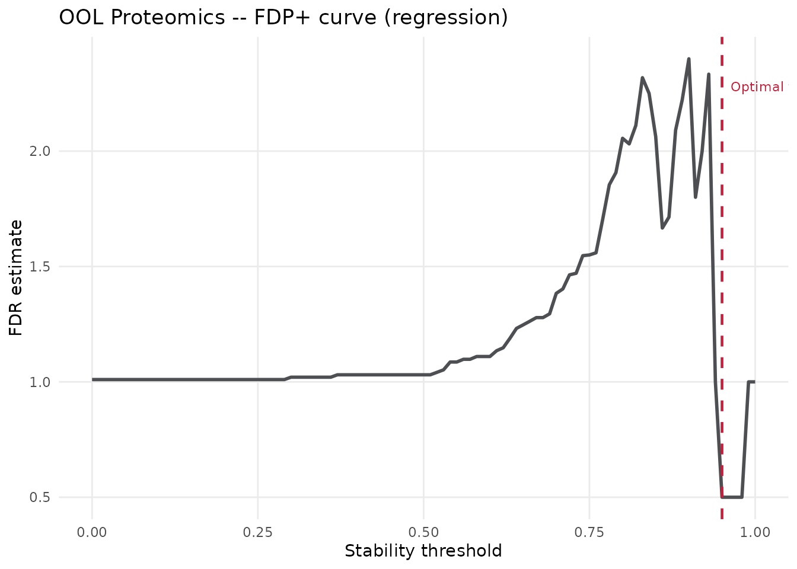
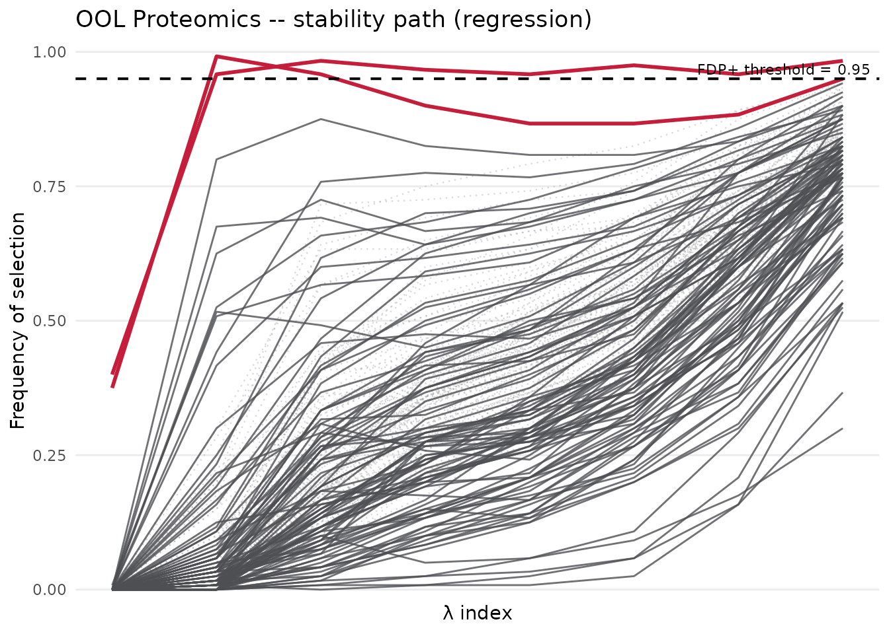
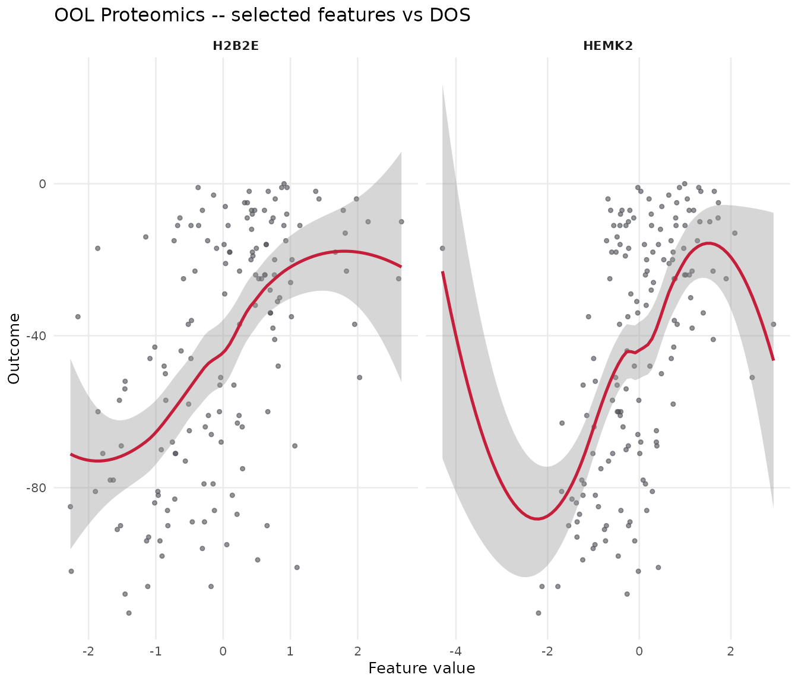

# Python-R Workflow Mapping for STABL

## Overview

This vignette maps the analyses from the STABL Tutorial Notebook onto
the R `stablr` API. It uses the same preprocessing shape and real OOL
validation workflow, but the rendered run uses bounded settings so
package builds remain practical. Use the larger settings noted below for
a high-fidelity parity experiment.

| Aspect | Python (`stabl`) | R (`stablr`) |
|----|----|----|
| Base learner | `sklearn.linear_model.Lasso` | [`glmnet::glmnet`](https://glmnet.stanford.edu/reference/glmnet.html) (LASSO) |
| Bootstrapping | `n_bootstraps` | `n_bootstraps` |
| FDP control | `fdr_threshold_range = np.arange(0, 1, 0.01)` | `seq(0, 1, by = 0.01)` |
| Artificial features | `"knockoff"` in the tutorial | `random_permutation` here for render speed; `knockoff` for extended parity |
| Random state | `42` | `random_state = 42L` |

**Two analyses:**

1.  **OOL Regression** – Onset of Labor proteomics,
    `family = "gaussian"`, real train/validation split, bounded STABL
    settings.
2.  **COVID-19 Binary Classification** – Proteomics,
    `family = "binomial"`, shown as an extended optional run because the
    data are not bundled with the package build.

``` r
library(stablr)

render_n_bootstraps <- 120L
render_n_lambda <- 8L
render_artificial_type <- "random_permutation"
run_extended <- identical(Sys.getenv("STABLR_RUN_EXTENDED_VIGNETTES"), "true")
```

The rendered configuration uses 120 bootstraps and 8 lambda values. For
a parity report intended to match the Python tutorial more closely, use
500-1000 bootstraps with `artificial_type = "knockoff"` and run outside
package-build time.

------------------------------------------------------------------------

## Preprocessing helpers

The Python tutorial uses:
`VarianceThreshold -> LowInfoFilter -> SimpleImputer (median) -> StandardScaler`.

``` r
preprocess_fit <- function(x, min_var = 1e-6) {
  col_vars  <- apply(x, 2, var, na.rm = TRUE)
  keep_cols <- col_vars > min_var
  x <- x[, keep_cols, drop = FALSE]
  col_medians <- apply(x, 2, median, na.rm = TRUE)
  for (j in seq_along(col_medians)) {
    na_idx <- is.na(x[, j])
    if (any(na_idx)) x[na_idx, j] <- col_medians[j]
  }
  col_means <- colMeans(x)
  col_sds   <- apply(x, 2, sd)
  col_sds[col_sds < 1e-10] <- 1
  x <- sweep(sweep(x, 2, col_means), 2, col_sds, "/")
  list(x = x, keep_cols = keep_cols, col_medians = col_medians,
       col_means = col_means, col_sds = col_sds)
}

preprocess_apply <- function(x, pipe) {
  x <- x[, pipe$keep_cols, drop = FALSE]
  for (j in seq_len(ncol(x))) {
    na_idx <- is.na(x[, j])
    if (any(na_idx)) x[na_idx, j] <- pipe$col_medians[j]
  }
  sweep(sweep(x, 2, pipe$col_means), 2, pipe$col_sds, "/")
}
```

------------------------------------------------------------------------

## Part 1 – Regression: Onset of Labor Proteomics

``` r
ool_train <- load_ool_data(split = "train")
ool_valid <- load_ool_data(split = "valid")

pipe_prot    <- preprocess_fit(ool_train$x_list$proteomics)
x_prot       <- pipe_prot$x
y_prot       <- ool_train$y
x_prot_valid <- preprocess_apply(ool_valid$x_list$proteomics, pipe_prot)
y_prot_valid <- ool_valid$y

cat("Training set:   ", nrow(x_prot), "samples x", ncol(x_prot), "features\n")
#> Training set:    150 samples x 100 features
cat("Validation set: ", nrow(x_prot_valid), "samples x", ncol(x_prot_valid), "features\n")
#> Validation set:  21 samples x 100 features
```

``` r
lambda_prot <- auto_lambda_grid(
  x_prot, y_prot,
  family   = "gaussian",
  n_lambda = render_n_lambda
)
```

``` r
set.seed(42)
fit_prot <- stabl_fit(
  x                   = x_prot,
  y                   = y_prot,
  lambda_grid         = lambda_prot,
  base_learner        = "lasso",
  family              = "gaussian",
  n_bootstraps        = render_n_bootstraps,
  artificial_type     = render_artificial_type,
  fdr_threshold_range = seq(0, 1, by = 0.01),
  random_state        = 42L
)
fit_prot
#> <stabl_fit>
#>   Features in:      100 
#>   Features selected: 2 
#>   Min FDP+:         0.5 
#>   FDP+ threshold:   0.95 
#>   Artificial:       random_permutation
```

``` r
sel_prot <- get_support(fit_prot)
cat("Selected features (n =", sum(sel_prot), "):\n")
#> Selected features (n = 2 ):
print(names(which(sel_prot)))
#> [1] "HEMK2" "H2B2E"
cat("\nTop 10 stability scores:\n")
#> 
#> Top 10 stability scores:
print(head(sort(get_importances(fit_prot), decreasing = TRUE), 10))
#>     H2B2E     HEMK2     SMOC1     Mcl.1       PSP      CD59      ApoM       H31 
#> 0.9916667 0.9833333 0.9416667 0.9250000 0.9166667 0.9000000 0.9000000 0.9000000 
#>     NEGR1     c.Myc 
#> 0.8916667 0.8833333
```

``` r
plot_fdr_graph(fit_prot, title = "OOL Proteomics -- FDP+ curve (regression)")
```



``` r
plot_stabl_path(fit_prot, title = "OOL Proteomics -- stability path (regression)")
```



``` r
sel_prot_names <- names(which(sel_prot))
if (length(sel_prot_names) > 0) {
  scatterplot_features(
    features = sel_prot_names,
    x        = x_prot,
    y        = y_prot,
    title    = "OOL Proteomics -- selected features vs DOS"
  )
}
```



------------------------------------------------------------------------

## Part 2 – Binary Classification: COVID-19 Proteomics

``` r
covid_train_dir <- normalizePath(
  file.path(system.file("", package = "stablr"),
            "..", "..", "..", "..", "Sample Data", "COVID-19", "Training"),
  mustWork = FALSE
)
eval_covid <- dir.exists(covid_train_dir) &&
              file.exists(file.path(covid_train_dir, "Proteomics.csv")) &&
              isTRUE(run_extended)
if (!dir.exists(covid_train_dir)) {
  message("COVID-19 data not found -- skipping COVID-19 section.")
} else if (!isTRUE(run_extended)) {
  message("COVID-19 data found, but the section is skipped by default. Set STABLR_RUN_EXTENDED_VIGNETTES=true to evaluate it.")
}
#> COVID-19 data not found -- skipping COVID-19 section.
```

``` r
covid_valid_dir <- file.path(dirname(covid_train_dir), "Validation")

prot_tr  <- as.matrix(read.csv(file.path(covid_train_dir, "Proteomics.csv"),
                                row.names = 1, check.names = FALSE))
y_tr_df  <- read.csv(file.path(covid_train_dir, "Mild&ModVsSevere.csv"),
                      row.names = 1, check.names = FALSE)
prot_val <- as.matrix(read.csv(file.path(covid_valid_dir, "Validation_proteomics.csv"),
                                row.names = 1, check.names = FALSE))
y_val_df <- read.csv(
  file.path(covid_valid_dir, "Validation_outcome(WHO.0 >= 5).csv"),
  row.names = 1, check.names = FALSE)

common_tr  <- intersect(rownames(prot_tr),  rownames(y_tr_df))
common_val <- intersect(rownames(prot_val), rownames(y_val_df))

pipe_covid    <- preprocess_fit(prot_tr[common_tr, ])
x_covid_train <- pipe_covid$x
y_covid_train <- setNames(as.integer(y_tr_df[common_tr, 1]), common_tr)
x_covid_valid <- preprocess_apply(prot_val[common_val, ], pipe_covid)
y_covid_valid <- setNames(as.integer(y_val_df[common_val, 1]), common_val)

cat("COVID train:", nrow(x_covid_train), "x", ncol(x_covid_train), "\n")
cat("COVID valid:", nrow(x_covid_valid), "x", ncol(x_covid_valid), "\n")
print(table(y_covid_train))
```

``` r
lambda_covid <- auto_lambda_grid(
  x_covid_train, y_covid_train,
  family   = "binomial",
  n_lambda = render_n_lambda
)
```

``` r
set.seed(42)
fit_covid <- stabl_fit(
  x                   = x_covid_train,
  y                   = y_covid_train,
  lambda_grid         = lambda_covid,
  base_learner        = "lasso",
  family              = "binomial",
  n_bootstraps        = 200L,
  artificial_type     = render_artificial_type,
  fdr_threshold_range = seq(0.1, 1, by = 0.01),
  random_state        = 42L
)
fit_covid
```

``` r
sel_covid <- get_support(fit_covid)
cat("Selected features (n =", sum(sel_covid), "):\n")
print(names(which(sel_covid)))
```

``` r
plot_fdr_graph(fit_covid, title = "COVID-19 Proteomics -- FDP+ curve")
```

``` r
plot_stabl_path(fit_covid, title = "COVID-19 Proteomics -- stability path")
```

``` r
sel_covid_names <- names(which(sel_covid))
if (length(sel_covid_names) > 0) {
  boxplot_features(
    features = sel_covid_names,
    x        = x_covid_train,
    y        = factor(y_covid_train, labels = c("Mild/Mod", "Severe")),
    title    = "COVID-19 -- selected features (training)"
  )
}
```

------------------------------------------------------------------------

## Part 3 – Full pipeline: validation performance

``` r
sel_names_prot <- names(which(get_support(fit_prot)))
cat("OOL: using", length(sel_names_prot), "selected features for final model\n")
#> OOL: using 2 selected features for final model

if (length(sel_names_prot) > 0) {
  df_tr <- as.data.frame(x_prot[, sel_names_prot, drop = FALSE])
  df_tr$y <- y_prot
  final_lm <- lm(y ~ ., data = df_tr)

  df_val <- as.data.frame(x_prot_valid[, sel_names_prot, drop = FALSE])
  y_pred_val <- predict(final_lm, newdata = df_val)

  cat("Validation Pearson r:", round(cor(y_pred_val, y_prot_valid), 3), "\n")
  cat("Validation RMSE:     ", round(sqrt(mean((y_pred_val - y_prot_valid)^2)), 2), "\n")
} else {
  cat("No features selected -- cannot build final model.\n")
}
#> Validation Pearson r: 0.21 
#> Validation RMSE:      33.33
```

``` r
sel_names_covid <- names(which(get_support(fit_covid)))
cat("COVID-19: using", length(sel_names_covid), "selected features for final model\n")

if (length(sel_names_covid) > 0) {
  df_tr_c <- as.data.frame(x_covid_train[, sel_names_covid, drop = FALSE])
  df_tr_c$y <- y_covid_train
  final_glm <- glm(y ~ ., data = df_tr_c, family = binomial())

  df_val_c <- as.data.frame(x_covid_valid[, sel_names_covid, drop = FALSE])
  y_pred_covid <- predict(final_glm, newdata = df_val_c, type = "response")

  plot_roc(y_true = y_covid_valid, y_preds = y_pred_covid,
           title = "COVID-19 -- Validation ROC")
  plot_prc(y_true = y_covid_valid, y_preds = y_pred_covid,
           title = "COVID-19 -- Validation PRC")
} else {
  cat("No features selected -- cannot build final model.\n")
}
```

------------------------------------------------------------------------

## Parity notes

- `glmnet` LASSO and scikit-learn LASSO differ in coordinate descent
  implementation. Feature selections should be concordant but not
  identical.
- The rendered vignette uses random-permutation decoys for speed. For
  high-fidelity parity work, switch to `artificial_type = "knockoff"`
  and use the Python tutorial bootstrap counts.
- Stability scores should be compared at matched bootstrap counts,
  artificial feature strategy, lambda grid, and preprocessing choices.

``` r
sessionInfo()
#> R version 4.5.1 (2025-06-13)
#> Platform: x86_64-conda-linux-gnu
#> Running under: Rocky Linux 8.10 (Green Obsidian)
#> 
#> Matrix products: default
#> BLAS/LAPACK: /exports/archive/hg-funcgenom-research/mdmanurung/conda/envs/R4_51/lib/libopenblasp-r0.3.29.so;  LAPACK version 3.12.0
#> 
#> locale:
#>  [1] LC_CTYPE=C.UTF-8       LC_NUMERIC=C           LC_TIME=C.UTF-8       
#>  [4] LC_COLLATE=C.UTF-8     LC_MONETARY=C.UTF-8    LC_MESSAGES=C.UTF-8   
#>  [7] LC_PAPER=C.UTF-8       LC_NAME=C              LC_ADDRESS=C          
#> [10] LC_TELEPHONE=C         LC_MEASUREMENT=C.UTF-8 LC_IDENTIFICATION=C   
#> 
#> time zone: Europe/Amsterdam
#> tzcode source: system (glibc)
#> 
#> attached base packages:
#> [1] stats     graphics  grDevices utils     datasets  methods   base     
#> 
#> other attached packages:
#> [1] stablr_0.0.0.9000
#> 
#> loaded via a namespace (and not attached):
#>  [1] sass_0.4.10        generics_0.1.4     shape_1.4.6.1      lattice_0.22-9    
#>  [5] digest_0.6.39      magrittr_2.0.4     evaluate_1.0.5     grid_4.5.1        
#>  [9] RColorBrewer_1.1-3 iterators_1.0.14   fastmap_1.2.0      foreach_1.5.2     
#> [13] jsonlite_2.0.0     glmnet_4.1-10      Matrix_1.7-5       survival_3.8-6    
#> [17] mgcv_1.9-4         scales_1.4.0       codetools_0.2-20   textshaping_1.0.4 
#> [21] jquerylib_0.1.4    cli_3.6.6          rlang_1.2.0        splines_4.5.1     
#> [25] withr_3.0.2        cachem_1.1.0       yaml_2.3.11        otel_0.2.0        
#> [29] tools_4.5.1        dplyr_1.1.4        ggplot2_4.0.3      vctrs_0.7.3       
#> [33] R6_2.6.1           lifecycle_1.0.5    fs_2.1.0           htmlwidgets_1.6.4 
#> [37] ragg_1.5.0         pkgconfig_2.0.3    desc_1.4.3         pkgdown_2.2.0     
#> [41] bslib_0.10.0       pillar_1.11.1      gtable_0.3.6       glue_1.8.1        
#> [45] Rcpp_1.1.1-1.1     systemfonts_1.3.1  xfun_0.54          tibble_3.3.0      
#> [49] tidyselect_1.2.1   knitr_1.51         dichromat_2.0-0.1  farver_2.1.2      
#> [53] htmltools_0.5.9    nlme_3.1-169       rmarkdown_2.31     labeling_0.4.3    
#> [57] compiler_4.5.1     S7_0.2.2
```
