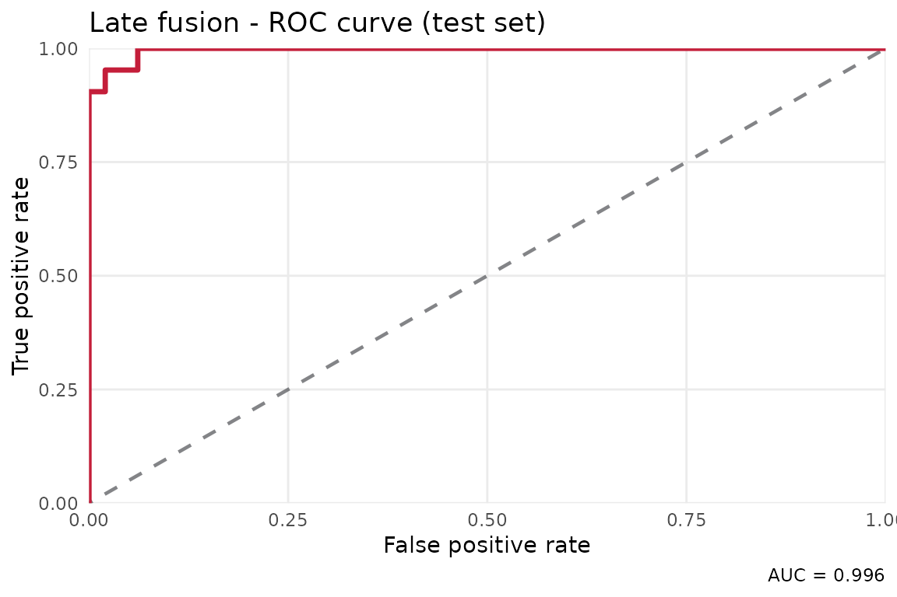
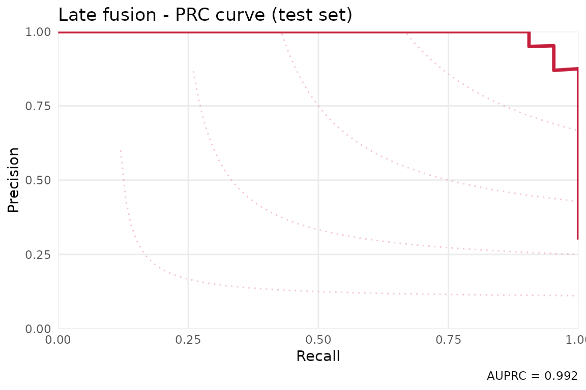

# TCGA Breast Cancer: Multi-Omic Biomarker Discovery with stablr

## Overview

This vignette translates the **mixOmics N-Integration Chapter 6** case
study into the `stablr` idiom. The original mixOmics workflow uses
sparse multi-block Discriminant Analysis (sgccaDA) to classify breast
cancer subtypes. Here we ask the same scientific question: which mRNA
and miRNA features robustly distinguish Basal-like tumours from all
other subtypes?

The analysis uses the real `breast.TCGA` train/test split from
`mixOmics`, but with compact STABL settings so the vignette is realistic
without becoming a long benchmark. Increase the bootstrap count and
lambda-grid size before using the result as publication evidence.

**Dataset:** `breast.TCGA` from the `mixOmics` package.

- Training: mRNA and miRNA measurements on the same tumour samples.
- Test: held-out mRNA and miRNA measurements with matching feature sets.
- Outcome: PAM50 subtype binarised to **Basal vs. non-Basal**.
- Protein data is excluded to match the two-omic scope used here.

## Prerequisites

``` r
if (!requireNamespace("mixOmics", quietly = TRUE)) {
  stop(
    "This vignette requires mixOmics (Bioconductor). ",
    "Install with: BiocManager::install('mixOmics')"
  )
}
library(stablr)
library(mixOmics)
#> Loading required package: MASS
#> Warning: package 'MASS' was built under R version 4.5.3
#> Loading required package: lattice
#> Warning: package 'lattice' was built under R version 4.5.2
#> Loading required package: ggplot2
#> Warning: package 'ggplot2' was built under R version 4.5.3
#> 
#> Loaded mixOmics 6.34.0
#> Thank you for using mixOmics!
#> Tutorials: http://mixomics.org
#> Bookdown vignette: https://mixomicsteam.github.io/Bookdown
#> Questions, issues: Follow the prompts at http://mixomics.org/contact-us
#> Cite us:  citation('mixOmics')
```

## 1. Load and prepare data

``` r
data(breast.TCGA)

X_train_mrna  <- breast.TCGA$data.train$mrna
X_train_mirna <- breast.TCGA$data.train$mirna
X_test_mrna   <- breast.TCGA$data.test$mrna
X_test_mirna  <- breast.TCGA$data.test$mirna

cat("Training mRNA:  ", nrow(X_train_mrna),  "x", ncol(X_train_mrna),  "\n")
#> Training mRNA:   150 x 200
cat("Training miRNA: ", nrow(X_train_mirna), "x", ncol(X_train_mirna), "\n")
#> Training miRNA:  150 x 184
cat("Test mRNA:      ", nrow(X_test_mrna),   "x", ncol(X_test_mrna),   "\n")
#> Test mRNA:       70 x 200
cat("Test miRNA:     ", nrow(X_test_mirna),  "x", ncol(X_test_mirna),  "\n")
#> Test miRNA:      70 x 184
```

``` r
subtype_train <- breast.TCGA$data.train$subtype
subtype_test  <- breast.TCGA$data.test$subtype

y_train <- as.integer(subtype_train == "Basal")
y_test  <- as.integer(subtype_test  == "Basal")

names(y_train) <- rownames(X_train_mrna)
names(y_test)  <- rownames(X_test_mrna)

cat("Training: ", sum(y_train), "Basal /", sum(y_train == 0), "non-Basal\n")
#> Training:  45 Basal / 105 non-Basal
cat("Test:     ", sum(y_test),  "Basal /", sum(y_test == 0),  "non-Basal\n")
#> Test:      21 Basal / 49 non-Basal
```

## 2. Per-omic STABL

We first assess each omic independently. This establishes a baseline
before running the integrated workflow. The vignette uses 30 bootstraps
and 12 lambda values to keep runtime bounded; use 500-1000 bootstraps
for final reporting.

``` r
lambda_mrna <- auto_lambda_grid(
  X_train_mrna, y_train,
  family   = "binomial",
  n_lambda = 12
)

fit_mrna <- stabl_fit(
  x               = X_train_mrna,
  y               = y_train,
  lambda_grid     = lambda_mrna,
  family          = "binomial",
  n_bootstraps    = 30L,
  artificial_type = "random_permutation",
  random_state    = 42L
)
fit_mrna
#> <stabl_fit>
#>   Features in:      200 
#>   Features selected: 28 
#>   Min FDP+:         0.0357 
#>   FDP+ threshold:   0.27 
#>   Artificial:       random_permutation
```

``` r
lambda_mirna <- auto_lambda_grid(
  X_train_mirna, y_train,
  family   = "binomial",
  n_lambda = 12
)

fit_mirna <- stabl_fit(
  x               = X_train_mirna,
  y               = y_train,
  lambda_grid     = lambda_mirna,
  family          = "binomial",
  n_bootstraps    = 30L,
  artificial_type = "random_permutation",
  random_state    = 42L
)
fit_mirna
#> <stabl_fit>
#>   Features in:      184 
#>   Features selected: 11 
#>   Min FDP+:         0.0909 
#>   FDP+ threshold:   0.5 
#>   Artificial:       random_permutation
```

``` r
cat("mRNA selected features:\n")
#> mRNA selected features:
print(get_support(fit_mrna))
#>      RTN2     NDRG2   CCDC113    FAM63A     ACADS      GMDS     HLA-H    SEMA4A 
#>     FALSE      TRUE     FALSE     FALSE     FALSE     FALSE     FALSE     FALSE 
#>      ETS2     LIMD2      NME3      ZEB1     CDCP1     GIYD2     RTKN2    MANSC1 
#>     FALSE     FALSE     FALSE     FALSE     FALSE     FALSE     FALSE     FALSE 
#>     TAGLN     IFIT3     ARL4C     HTRA1    KIF13B    CPPED1     SKAP2      ASPM 
#>     FALSE     FALSE     FALSE     FALSE     FALSE     FALSE     FALSE     FALSE 
#>     KDM4B    TBXAS1      MT1X    MED13L    SNORA8      RGS1      CBX6      WWC2 
#>     FALSE     FALSE     FALSE     FALSE      TRUE     FALSE     FALSE     FALSE 
#> TNFRSF12A    ZNF552    MAPRE2    SEMA5A    STAT5A      FLI1   COL15A1   C7orf55 
#>     FALSE      TRUE     FALSE     FALSE     FALSE     FALSE     FALSE     FALSE 
#>     ASF1B      FUT8     LASS4      SQLE      GPC4    AKAP12       AGL   ADAMTS4 
#>     FALSE      TRUE     FALSE     FALSE     FALSE     FALSE     FALSE     FALSE 
#>     EPHB3    MAP3K1      PRNP     PROM2   SLCO3A1     SNHG1   PRKCDBP      MXI1 
#>     FALSE     FALSE     FALSE     FALSE     FALSE     FALSE     FALSE     FALSE 
#>     CSF1R     TANC2   SLC19A2      RHOU   C4orf34     LRIG1     DOCK8       BOC 
#>     FALSE      TRUE     FALSE     FALSE      TRUE      TRUE     FALSE     FALSE 
#>  C11orf52   S100A16     NRARP     TTC23    TBC1D4    DEPDC6     ILDR1      SDC1 
#>     FALSE     FALSE     FALSE     FALSE      TRUE     FALSE     FALSE     FALSE 
#>      STC2     DTWD2      TCF4     ITPR2      DPYD      NME1     EGLN3     CD302 
#>     FALSE      TRUE     FALSE     FALSE     FALSE     FALSE     FALSE     FALSE 
#>       AHR   LAPTM4B      OCLN HIST1H2BK    HDAC11   C18orf1  C6orf192     AMPD3 
#>     FALSE     FALSE     FALSE     FALSE     FALSE     FALSE     FALSE     FALSE 
#>    COL6A1   RAB3IL1   APBB1IP     PSIP1   EIF2AK2     CSRP2  EIF4EBP3       LYN 
#>     FALSE     FALSE     FALSE      TRUE     FALSE     FALSE     FALSE      TRUE 
#>     WDR76    SAMD9L      ASPH      RBL1   SLC43A3       HN1    TTC39A      MTL5 
#>     FALSE     FALSE     FALSE     FALSE      TRUE     FALSE      TRUE     FALSE 
#>       NES      APOD      RIN3     ALCAM   C1orf38     PLCD3     BSPRY      NTN4 
#>      TRUE     FALSE      TRUE      TRUE     FALSE     FALSE     FALSE     FALSE 
#>     IL1R1      EMP3   ZKSCAN1     FMNL2    OGFRL1      IRF5     IGSF3       DBP 
#>     FALSE     FALSE     FALSE     FALSE      TRUE     FALSE     FALSE     FALSE 
#>      CNN2    CAMK2D    SIGIRR     AKAP9      ICA1      FGD5      DSG2      E2F1 
#>     FALSE     FALSE     FALSE     FALSE     FALSE     FALSE     FALSE     FALSE 
#>     QSOX1      TOB1     CSF3R   SHROOM3    CCDC80     FRMD6    CXCL12     CCNA2 
#>     FALSE     FALSE     FALSE     FALSE     FALSE     FALSE     FALSE     FALSE 
#>     TIGD5   ALDH6A1     POSTN      FZD4    NCAPG2      SDC4     SNED1   PLEKHA4 
#>     FALSE     FALSE     FALSE     FALSE      TRUE     FALSE     FALSE     FALSE 
#>    KCNAB2   SH3KBP1     IGSF9      DNLZ     S1PR3     PTPRE  FLJ23867    PLSCR1 
#>     FALSE     FALSE     FALSE     FALSE     FALSE     FALSE      TRUE     FALSE 
#>      LMO4    IFITM2    LRRC25       TST      NCF4     NCOA7      IL4R   CCDC64B 
#>     FALSE     FALSE     FALSE     FALSE     FALSE     FALSE     FALSE     FALSE 
#>     SGPP1     RUNX3    SLC5A6     IFIH1     PREX1     PLAUR     CDK18   SLC43A2 
#>     FALSE     FALSE     FALSE     FALSE      TRUE     FALSE      TRUE     FALSE 
#>        GK     ICAM2     YPEL2      CBR1     MEX3A     ZNRF3     PTPRM  C1orf162 
#>     FALSE     FALSE      TRUE      TRUE      TRUE     FALSE     FALSE     FALSE 
#>      GAS6      C1QB     PVRL4      CTSK     MRVI1      LEF1     PLCD4    ZNF37B 
#>     FALSE     FALSE     FALSE     FALSE     FALSE     FALSE     FALSE     FALSE 
#>     MEGF9     GINS2    FAM13A     CPT1A     SNX10    TRIM45      ELP2     ALOX5 
#>      TRUE     FALSE     FALSE      TRUE     FALSE     FALSE     FALSE     FALSE 
#>      AMN1    CERCAM    SEMA3C      KRT8  TP53INP2      JAM3    ZNF680      PBX1 
#>     FALSE     FALSE      TRUE      TRUE     FALSE     FALSE     FALSE     FALSE

cat("\nmiRNA selected features:\n")
#> 
#> miRNA selected features:
print(get_support(fit_mirna))
#>   hsa-let-7a-1   hsa-let-7a-2   hsa-let-7a-3     hsa-let-7b     hsa-let-7c 
#>          FALSE          FALSE          FALSE          FALSE          FALSE 
#>     hsa-let-7d     hsa-let-7e   hsa-let-7f-1   hsa-let-7f-2     hsa-let-7g 
#>          FALSE          FALSE          FALSE          FALSE          FALSE 
#>     hsa-let-7i    hsa-mir-100  hsa-mir-101-1  hsa-mir-101-2  hsa-mir-103-1 
#>          FALSE          FALSE          FALSE          FALSE          FALSE 
#>  hsa-mir-103-2   hsa-mir-106a   hsa-mir-106b    hsa-mir-107    hsa-mir-10a 
#>          FALSE           TRUE           TRUE          FALSE          FALSE 
#>    hsa-mir-10b   hsa-mir-125a hsa-mir-125b-1    hsa-mir-126    hsa-mir-127 
#>          FALSE          FALSE          FALSE          FALSE          FALSE 
#>  hsa-mir-128-1  hsa-mir-128-2   hsa-mir-1287   hsa-mir-1301   hsa-mir-1307 
#>          FALSE          FALSE          FALSE          FALSE          FALSE 
#>   hsa-mir-130a   hsa-mir-130b    hsa-mir-132    hsa-mir-134    hsa-mir-139 
#>          FALSE           TRUE          FALSE          FALSE          FALSE 
#>    hsa-mir-140    hsa-mir-141    hsa-mir-142    hsa-mir-143    hsa-mir-144 
#>          FALSE          FALSE          FALSE          FALSE          FALSE 
#>    hsa-mir-145   hsa-mir-146a   hsa-mir-146b   hsa-mir-148a   hsa-mir-148b 
#>          FALSE          FALSE          FALSE          FALSE          FALSE 
#>    hsa-mir-149    hsa-mir-150    hsa-mir-151    hsa-mir-152    hsa-mir-155 
#>           TRUE          FALSE          FALSE          FALSE          FALSE 
#>    hsa-mir-15a    hsa-mir-15b   hsa-mir-16-1   hsa-mir-16-2     hsa-mir-17 
#>          FALSE          FALSE          FALSE          FALSE           TRUE 
#> hsa-mir-181a-1 hsa-mir-181a-2 hsa-mir-181b-1   hsa-mir-181c   hsa-mir-181d 
#>          FALSE          FALSE          FALSE          FALSE          FALSE 
#>    hsa-mir-182    hsa-mir-183    hsa-mir-185    hsa-mir-186    hsa-mir-191 
#>          FALSE          FALSE          FALSE          FALSE          FALSE 
#>    hsa-mir-192   hsa-mir-193a   hsa-mir-193b  hsa-mir-194-1  hsa-mir-194-2 
#>          FALSE          FALSE          FALSE          FALSE          FALSE 
#>    hsa-mir-195 hsa-mir-196a-1   hsa-mir-196b    hsa-mir-197 hsa-mir-199a-1 
#>          FALSE          FALSE          FALSE          FALSE          FALSE 
#> hsa-mir-199a-2   hsa-mir-199b  hsa-mir-19b-2   hsa-mir-200a   hsa-mir-200b 
#>          FALSE          FALSE          FALSE          FALSE          FALSE 
#>   hsa-mir-200c    hsa-mir-203    hsa-mir-205    hsa-mir-20a     hsa-mir-21 
#>          FALSE          FALSE          FALSE           TRUE          FALSE 
#>    hsa-mir-210    hsa-mir-214  hsa-mir-218-2     hsa-mir-22    hsa-mir-221 
#>          FALSE          FALSE          FALSE          FALSE          FALSE 
#>    hsa-mir-222    hsa-mir-223   hsa-mir-2355    hsa-mir-23a    hsa-mir-23b 
#>          FALSE          FALSE          FALSE          FALSE          FALSE 
#>   hsa-mir-24-1   hsa-mir-24-2     hsa-mir-25  hsa-mir-26a-2    hsa-mir-26b 
#>          FALSE          FALSE          FALSE          FALSE          FALSE 
#>    hsa-mir-27a    hsa-mir-27b     hsa-mir-28    hsa-mir-29a  hsa-mir-29b-1 
#>          FALSE          FALSE          FALSE          FALSE          FALSE 
#>  hsa-mir-29b-2    hsa-mir-29c   hsa-mir-3065   hsa-mir-3074    hsa-mir-30a 
#>          FALSE          FALSE          FALSE          FALSE          FALSE 
#>    hsa-mir-30b  hsa-mir-30c-2    hsa-mir-30d    hsa-mir-30e     hsa-mir-32 
#>          FALSE          FALSE          FALSE           TRUE          FALSE 
#>   hsa-mir-320a    hsa-mir-324    hsa-mir-328    hsa-mir-330    hsa-mir-331 
#>          FALSE          FALSE          FALSE          FALSE          FALSE 
#>    hsa-mir-337    hsa-mir-338    hsa-mir-339    hsa-mir-340    hsa-mir-342 
#>          FALSE          FALSE          FALSE          FALSE          FALSE 
#>    hsa-mir-345    hsa-mir-34a   hsa-mir-3607    hsa-mir-361   hsa-mir-3613 
#>          FALSE          FALSE          FALSE          FALSE          FALSE 
#>   hsa-mir-3647  hsa-mir-365-1  hsa-mir-365-2   hsa-mir-3653   hsa-mir-374a 
#>          FALSE          FALSE          FALSE          FALSE          FALSE 
#>   hsa-mir-374b    hsa-mir-375    hsa-mir-378    hsa-mir-379    hsa-mir-381 
#>          FALSE           TRUE          FALSE          FALSE          FALSE 
#>    hsa-mir-409    hsa-mir-423    hsa-mir-424    hsa-mir-425    hsa-mir-429 
#>          FALSE          FALSE          FALSE          FALSE          FALSE 
#>    hsa-mir-451    hsa-mir-452    hsa-mir-454    hsa-mir-455    hsa-mir-484 
#>          FALSE          FALSE          FALSE           TRUE          FALSE 
#>    hsa-mir-486    hsa-mir-497   hsa-mir-500a    hsa-mir-501    hsa-mir-505 
#>          FALSE          FALSE          FALSE          FALSE           TRUE 
#>    hsa-mir-532    hsa-mir-539    hsa-mir-542    hsa-mir-574    hsa-mir-576 
#>          FALSE          FALSE          FALSE          FALSE          FALSE 
#>    hsa-mir-582    hsa-mir-584    hsa-mir-589    hsa-mir-590    hsa-mir-625 
#>          FALSE           TRUE          FALSE          FALSE          FALSE 
#>    hsa-mir-628    hsa-mir-629    hsa-mir-660    hsa-mir-664    hsa-mir-7-1 
#>          FALSE          FALSE          FALSE          FALSE          FALSE 
#>    hsa-mir-708    hsa-mir-744    hsa-mir-769    hsa-mir-874    hsa-mir-9-1 
#>          FALSE          FALSE          FALSE          FALSE          FALSE 
#>    hsa-mir-9-2  hsa-mir-92a-1  hsa-mir-92a-2    hsa-mir-92b     hsa-mir-93 
#>          FALSE          FALSE          FALSE          FALSE          FALSE 
#>     hsa-mir-96     hsa-mir-98    hsa-mir-99a    hsa-mir-99b 
#>          FALSE          FALSE          FALSE          FALSE
```

``` r
print(plot_stabl_path(fit_mrna,  title = "mRNA - stability path"))
```


``` r
print(plot_stabl_path(fit_mirna, title = "miRNA - stability path"))
```


## 3. Integrated multi-omic pipeline

The integrated workflow fits per-omic STABL models, an early-fusion
STABL model on the concatenated feature matrix, and a late-fusion
validation predictor.

``` r
lambda_list <- list(
  mrna  = lambda_mrna,
  mirna = lambda_mirna
)

multi_fit <- stabl_multiomic_train_validate(
  x_train_list    = list(mrna = X_train_mrna,  mirna = X_train_mirna),
  x_valid_list    = list(mrna = X_test_mrna,   mirna = X_test_mirna),
  y_train         = y_train,
  y_valid         = y_test,
  lambda_grid     = lambda_list,
  family          = "binomial",
  n_bootstraps    = 30L,
  artificial_type = "random_permutation",
  random_state    = 42L,
  early_fusion    = TRUE,
  late_fusion     = TRUE,
  n_iter_lf       = 500L
)
#> Warning: glm.fit: algorithm did not converge
#> Warning: glm.fit: fitted probabilities numerically 0 or 1 occurred
#> Warning: glm.fit: fitted probabilities numerically 0 or 1 occurred
multi_fit
#> <stabl_multiomic_fit>
#>   Omics:           2 (mrna, mirna)
#>   Per-omic selected features:
#>     mrna: 28
#>     mirna: 11
#>   Validation data:  yes 
#>   Early fusion:     yes (53 features selected) 
#>   Late fusion:      yes (score = 1)
```

``` r
cat("mRNA (integrated):\n")
#> mRNA (integrated):
print(get_support(multi_fit$fits$mrna))
#>      RTN2     NDRG2   CCDC113    FAM63A     ACADS      GMDS     HLA-H    SEMA4A 
#>     FALSE      TRUE     FALSE     FALSE     FALSE     FALSE     FALSE     FALSE 
#>      ETS2     LIMD2      NME3      ZEB1     CDCP1     GIYD2     RTKN2    MANSC1 
#>     FALSE     FALSE     FALSE     FALSE     FALSE     FALSE     FALSE     FALSE 
#>     TAGLN     IFIT3     ARL4C     HTRA1    KIF13B    CPPED1     SKAP2      ASPM 
#>     FALSE     FALSE     FALSE     FALSE     FALSE     FALSE     FALSE     FALSE 
#>     KDM4B    TBXAS1      MT1X    MED13L    SNORA8      RGS1      CBX6      WWC2 
#>     FALSE     FALSE     FALSE     FALSE      TRUE     FALSE     FALSE     FALSE 
#> TNFRSF12A    ZNF552    MAPRE2    SEMA5A    STAT5A      FLI1   COL15A1   C7orf55 
#>     FALSE      TRUE     FALSE     FALSE     FALSE     FALSE     FALSE     FALSE 
#>     ASF1B      FUT8     LASS4      SQLE      GPC4    AKAP12       AGL   ADAMTS4 
#>     FALSE      TRUE     FALSE     FALSE     FALSE     FALSE     FALSE     FALSE 
#>     EPHB3    MAP3K1      PRNP     PROM2   SLCO3A1     SNHG1   PRKCDBP      MXI1 
#>     FALSE     FALSE     FALSE     FALSE     FALSE     FALSE     FALSE     FALSE 
#>     CSF1R     TANC2   SLC19A2      RHOU   C4orf34     LRIG1     DOCK8       BOC 
#>     FALSE      TRUE     FALSE     FALSE      TRUE      TRUE     FALSE     FALSE 
#>  C11orf52   S100A16     NRARP     TTC23    TBC1D4    DEPDC6     ILDR1      SDC1 
#>     FALSE     FALSE     FALSE     FALSE      TRUE     FALSE     FALSE     FALSE 
#>      STC2     DTWD2      TCF4     ITPR2      DPYD      NME1     EGLN3     CD302 
#>     FALSE      TRUE     FALSE     FALSE     FALSE     FALSE     FALSE     FALSE 
#>       AHR   LAPTM4B      OCLN HIST1H2BK    HDAC11   C18orf1  C6orf192     AMPD3 
#>     FALSE     FALSE     FALSE     FALSE     FALSE     FALSE     FALSE     FALSE 
#>    COL6A1   RAB3IL1   APBB1IP     PSIP1   EIF2AK2     CSRP2  EIF4EBP3       LYN 
#>     FALSE     FALSE     FALSE      TRUE     FALSE     FALSE     FALSE      TRUE 
#>     WDR76    SAMD9L      ASPH      RBL1   SLC43A3       HN1    TTC39A      MTL5 
#>     FALSE     FALSE     FALSE     FALSE      TRUE     FALSE      TRUE     FALSE 
#>       NES      APOD      RIN3     ALCAM   C1orf38     PLCD3     BSPRY      NTN4 
#>      TRUE     FALSE      TRUE      TRUE     FALSE     FALSE     FALSE     FALSE 
#>     IL1R1      EMP3   ZKSCAN1     FMNL2    OGFRL1      IRF5     IGSF3       DBP 
#>     FALSE     FALSE     FALSE     FALSE      TRUE     FALSE     FALSE     FALSE 
#>      CNN2    CAMK2D    SIGIRR     AKAP9      ICA1      FGD5      DSG2      E2F1 
#>     FALSE     FALSE     FALSE     FALSE     FALSE     FALSE     FALSE     FALSE 
#>     QSOX1      TOB1     CSF3R   SHROOM3    CCDC80     FRMD6    CXCL12     CCNA2 
#>     FALSE     FALSE     FALSE     FALSE     FALSE     FALSE     FALSE     FALSE 
#>     TIGD5   ALDH6A1     POSTN      FZD4    NCAPG2      SDC4     SNED1   PLEKHA4 
#>     FALSE     FALSE     FALSE     FALSE      TRUE     FALSE     FALSE     FALSE 
#>    KCNAB2   SH3KBP1     IGSF9      DNLZ     S1PR3     PTPRE  FLJ23867    PLSCR1 
#>     FALSE     FALSE     FALSE     FALSE     FALSE     FALSE      TRUE     FALSE 
#>      LMO4    IFITM2    LRRC25       TST      NCF4     NCOA7      IL4R   CCDC64B 
#>     FALSE     FALSE     FALSE     FALSE     FALSE     FALSE     FALSE     FALSE 
#>     SGPP1     RUNX3    SLC5A6     IFIH1     PREX1     PLAUR     CDK18   SLC43A2 
#>     FALSE     FALSE     FALSE     FALSE      TRUE     FALSE      TRUE     FALSE 
#>        GK     ICAM2     YPEL2      CBR1     MEX3A     ZNRF3     PTPRM  C1orf162 
#>     FALSE     FALSE      TRUE      TRUE      TRUE     FALSE     FALSE     FALSE 
#>      GAS6      C1QB     PVRL4      CTSK     MRVI1      LEF1     PLCD4    ZNF37B 
#>     FALSE     FALSE     FALSE     FALSE     FALSE     FALSE     FALSE     FALSE 
#>     MEGF9     GINS2    FAM13A     CPT1A     SNX10    TRIM45      ELP2     ALOX5 
#>      TRUE     FALSE     FALSE      TRUE     FALSE     FALSE     FALSE     FALSE 
#>      AMN1    CERCAM    SEMA3C      KRT8  TP53INP2      JAM3    ZNF680      PBX1 
#>     FALSE     FALSE      TRUE      TRUE     FALSE     FALSE     FALSE     FALSE

cat("\nmiRNA (integrated):\n")
#> 
#> miRNA (integrated):
print(get_support(multi_fit$fits$mirna))
#>   hsa-let-7a-1   hsa-let-7a-2   hsa-let-7a-3     hsa-let-7b     hsa-let-7c 
#>          FALSE          FALSE          FALSE          FALSE          FALSE 
#>     hsa-let-7d     hsa-let-7e   hsa-let-7f-1   hsa-let-7f-2     hsa-let-7g 
#>          FALSE          FALSE          FALSE          FALSE          FALSE 
#>     hsa-let-7i    hsa-mir-100  hsa-mir-101-1  hsa-mir-101-2  hsa-mir-103-1 
#>          FALSE          FALSE          FALSE          FALSE          FALSE 
#>  hsa-mir-103-2   hsa-mir-106a   hsa-mir-106b    hsa-mir-107    hsa-mir-10a 
#>          FALSE           TRUE           TRUE          FALSE          FALSE 
#>    hsa-mir-10b   hsa-mir-125a hsa-mir-125b-1    hsa-mir-126    hsa-mir-127 
#>          FALSE          FALSE          FALSE          FALSE          FALSE 
#>  hsa-mir-128-1  hsa-mir-128-2   hsa-mir-1287   hsa-mir-1301   hsa-mir-1307 
#>          FALSE          FALSE          FALSE          FALSE          FALSE 
#>   hsa-mir-130a   hsa-mir-130b    hsa-mir-132    hsa-mir-134    hsa-mir-139 
#>          FALSE           TRUE          FALSE          FALSE          FALSE 
#>    hsa-mir-140    hsa-mir-141    hsa-mir-142    hsa-mir-143    hsa-mir-144 
#>          FALSE          FALSE          FALSE          FALSE          FALSE 
#>    hsa-mir-145   hsa-mir-146a   hsa-mir-146b   hsa-mir-148a   hsa-mir-148b 
#>          FALSE          FALSE          FALSE          FALSE          FALSE 
#>    hsa-mir-149    hsa-mir-150    hsa-mir-151    hsa-mir-152    hsa-mir-155 
#>           TRUE          FALSE          FALSE          FALSE          FALSE 
#>    hsa-mir-15a    hsa-mir-15b   hsa-mir-16-1   hsa-mir-16-2     hsa-mir-17 
#>          FALSE          FALSE          FALSE          FALSE           TRUE 
#> hsa-mir-181a-1 hsa-mir-181a-2 hsa-mir-181b-1   hsa-mir-181c   hsa-mir-181d 
#>          FALSE          FALSE          FALSE          FALSE          FALSE 
#>    hsa-mir-182    hsa-mir-183    hsa-mir-185    hsa-mir-186    hsa-mir-191 
#>          FALSE          FALSE          FALSE          FALSE          FALSE 
#>    hsa-mir-192   hsa-mir-193a   hsa-mir-193b  hsa-mir-194-1  hsa-mir-194-2 
#>          FALSE          FALSE          FALSE          FALSE          FALSE 
#>    hsa-mir-195 hsa-mir-196a-1   hsa-mir-196b    hsa-mir-197 hsa-mir-199a-1 
#>          FALSE          FALSE          FALSE          FALSE          FALSE 
#> hsa-mir-199a-2   hsa-mir-199b  hsa-mir-19b-2   hsa-mir-200a   hsa-mir-200b 
#>          FALSE          FALSE          FALSE          FALSE          FALSE 
#>   hsa-mir-200c    hsa-mir-203    hsa-mir-205    hsa-mir-20a     hsa-mir-21 
#>          FALSE          FALSE          FALSE           TRUE          FALSE 
#>    hsa-mir-210    hsa-mir-214  hsa-mir-218-2     hsa-mir-22    hsa-mir-221 
#>          FALSE          FALSE          FALSE          FALSE          FALSE 
#>    hsa-mir-222    hsa-mir-223   hsa-mir-2355    hsa-mir-23a    hsa-mir-23b 
#>          FALSE          FALSE          FALSE          FALSE          FALSE 
#>   hsa-mir-24-1   hsa-mir-24-2     hsa-mir-25  hsa-mir-26a-2    hsa-mir-26b 
#>          FALSE          FALSE          FALSE          FALSE          FALSE 
#>    hsa-mir-27a    hsa-mir-27b     hsa-mir-28    hsa-mir-29a  hsa-mir-29b-1 
#>          FALSE          FALSE          FALSE          FALSE          FALSE 
#>  hsa-mir-29b-2    hsa-mir-29c   hsa-mir-3065   hsa-mir-3074    hsa-mir-30a 
#>          FALSE          FALSE          FALSE          FALSE          FALSE 
#>    hsa-mir-30b  hsa-mir-30c-2    hsa-mir-30d    hsa-mir-30e     hsa-mir-32 
#>          FALSE          FALSE          FALSE           TRUE          FALSE 
#>   hsa-mir-320a    hsa-mir-324    hsa-mir-328    hsa-mir-330    hsa-mir-331 
#>          FALSE          FALSE          FALSE          FALSE          FALSE 
#>    hsa-mir-337    hsa-mir-338    hsa-mir-339    hsa-mir-340    hsa-mir-342 
#>          FALSE          FALSE          FALSE          FALSE          FALSE 
#>    hsa-mir-345    hsa-mir-34a   hsa-mir-3607    hsa-mir-361   hsa-mir-3613 
#>          FALSE          FALSE          FALSE          FALSE          FALSE 
#>   hsa-mir-3647  hsa-mir-365-1  hsa-mir-365-2   hsa-mir-3653   hsa-mir-374a 
#>          FALSE          FALSE          FALSE          FALSE          FALSE 
#>   hsa-mir-374b    hsa-mir-375    hsa-mir-378    hsa-mir-379    hsa-mir-381 
#>          FALSE           TRUE          FALSE          FALSE          FALSE 
#>    hsa-mir-409    hsa-mir-423    hsa-mir-424    hsa-mir-425    hsa-mir-429 
#>          FALSE          FALSE          FALSE          FALSE          FALSE 
#>    hsa-mir-451    hsa-mir-452    hsa-mir-454    hsa-mir-455    hsa-mir-484 
#>          FALSE          FALSE          FALSE           TRUE          FALSE 
#>    hsa-mir-486    hsa-mir-497   hsa-mir-500a    hsa-mir-501    hsa-mir-505 
#>          FALSE          FALSE          FALSE          FALSE           TRUE 
#>    hsa-mir-532    hsa-mir-539    hsa-mir-542    hsa-mir-574    hsa-mir-576 
#>          FALSE          FALSE          FALSE          FALSE          FALSE 
#>    hsa-mir-582    hsa-mir-584    hsa-mir-589    hsa-mir-590    hsa-mir-625 
#>          FALSE           TRUE          FALSE          FALSE          FALSE 
#>    hsa-mir-628    hsa-mir-629    hsa-mir-660    hsa-mir-664    hsa-mir-7-1 
#>          FALSE          FALSE          FALSE          FALSE          FALSE 
#>    hsa-mir-708    hsa-mir-744    hsa-mir-769    hsa-mir-874    hsa-mir-9-1 
#>          FALSE          FALSE          FALSE          FALSE          FALSE 
#>    hsa-mir-9-2  hsa-mir-92a-1  hsa-mir-92a-2    hsa-mir-92b     hsa-mir-93 
#>          FALSE          FALSE          FALSE          FALSE          FALSE 
#>     hsa-mir-96     hsa-mir-98    hsa-mir-99a    hsa-mir-99b 
#>          FALSE          FALSE          FALSE          FALSE

cat("\nEarly fusion selected features:\n")
#> 
#> Early fusion selected features:
print(get_support(multi_fit$early_fusion$fit))
#>           RTN2          NDRG2        CCDC113         FAM63A          ACADS 
#>          FALSE           TRUE          FALSE          FALSE          FALSE 
#>           GMDS          HLA-H         SEMA4A           ETS2          LIMD2 
#>          FALSE          FALSE          FALSE          FALSE          FALSE 
#>           NME3           ZEB1          CDCP1          GIYD2          RTKN2 
#>          FALSE          FALSE          FALSE          FALSE          FALSE 
#>         MANSC1          TAGLN          IFIT3          ARL4C          HTRA1 
#>          FALSE          FALSE          FALSE          FALSE          FALSE 
#>         KIF13B         CPPED1          SKAP2           ASPM          KDM4B 
#>          FALSE          FALSE          FALSE          FALSE          FALSE 
#>         TBXAS1           MT1X         MED13L         SNORA8           RGS1 
#>          FALSE          FALSE          FALSE           TRUE          FALSE 
#>           CBX6           WWC2      TNFRSF12A         ZNF552         MAPRE2 
#>          FALSE          FALSE          FALSE           TRUE          FALSE 
#>         SEMA5A         STAT5A           FLI1        COL15A1        C7orf55 
#>          FALSE          FALSE          FALSE          FALSE          FALSE 
#>          ASF1B           FUT8          LASS4           SQLE           GPC4 
#>          FALSE           TRUE          FALSE          FALSE          FALSE 
#>         AKAP12            AGL        ADAMTS4          EPHB3         MAP3K1 
#>          FALSE          FALSE          FALSE           TRUE          FALSE 
#>           PRNP          PROM2        SLCO3A1          SNHG1        PRKCDBP 
#>          FALSE           TRUE          FALSE          FALSE          FALSE 
#>           MXI1          CSF1R          TANC2        SLC19A2           RHOU 
#>          FALSE          FALSE           TRUE          FALSE          FALSE 
#>        C4orf34          LRIG1          DOCK8            BOC       C11orf52 
#>           TRUE           TRUE          FALSE          FALSE          FALSE 
#>        S100A16          NRARP          TTC23         TBC1D4         DEPDC6 
#>          FALSE          FALSE          FALSE           TRUE          FALSE 
#>          ILDR1           SDC1           STC2          DTWD2           TCF4 
#>          FALSE          FALSE          FALSE           TRUE          FALSE 
#>          ITPR2           DPYD           NME1          EGLN3          CD302 
#>          FALSE          FALSE          FALSE          FALSE          FALSE 
#>            AHR        LAPTM4B           OCLN      HIST1H2BK         HDAC11 
#>          FALSE          FALSE          FALSE          FALSE          FALSE 
#>        C18orf1       C6orf192          AMPD3         COL6A1        RAB3IL1 
#>          FALSE          FALSE          FALSE          FALSE          FALSE 
#>        APBB1IP          PSIP1        EIF2AK2          CSRP2       EIF4EBP3 
#>          FALSE           TRUE          FALSE           TRUE          FALSE 
#>            LYN          WDR76         SAMD9L           ASPH           RBL1 
#>           TRUE          FALSE          FALSE          FALSE          FALSE 
#>        SLC43A3            HN1         TTC39A           MTL5            NES 
#>           TRUE          FALSE           TRUE          FALSE           TRUE 
#>           APOD           RIN3          ALCAM        C1orf38          PLCD3 
#>          FALSE           TRUE           TRUE          FALSE          FALSE 
#>          BSPRY           NTN4          IL1R1           EMP3        ZKSCAN1 
#>          FALSE          FALSE          FALSE          FALSE           TRUE 
#>          FMNL2         OGFRL1           IRF5          IGSF3            DBP 
#>          FALSE           TRUE          FALSE          FALSE          FALSE 
#>           CNN2         CAMK2D         SIGIRR          AKAP9           ICA1 
#>          FALSE          FALSE          FALSE          FALSE          FALSE 
#>           FGD5           DSG2           E2F1          QSOX1           TOB1 
#>          FALSE          FALSE          FALSE          FALSE           TRUE 
#>          CSF3R        SHROOM3         CCDC80          FRMD6         CXCL12 
#>          FALSE           TRUE          FALSE           TRUE          FALSE 
#>          CCNA2          TIGD5        ALDH6A1          POSTN           FZD4 
#>          FALSE           TRUE          FALSE          FALSE          FALSE 
#>         NCAPG2           SDC4          SNED1        PLEKHA4         KCNAB2 
#>          FALSE          FALSE           TRUE          FALSE          FALSE 
#>        SH3KBP1          IGSF9           DNLZ          S1PR3          PTPRE 
#>          FALSE          FALSE          FALSE          FALSE          FALSE 
#>       FLJ23867         PLSCR1           LMO4         IFITM2         LRRC25 
#>           TRUE          FALSE           TRUE          FALSE          FALSE 
#>            TST           NCF4          NCOA7           IL4R        CCDC64B 
#>          FALSE          FALSE          FALSE          FALSE          FALSE 
#>          SGPP1          RUNX3         SLC5A6          IFIH1          PREX1 
#>          FALSE          FALSE           TRUE          FALSE           TRUE 
#>          PLAUR          CDK18        SLC43A2             GK          ICAM2 
#>          FALSE           TRUE          FALSE          FALSE          FALSE 
#>          YPEL2           CBR1          MEX3A          ZNRF3          PTPRM 
#>           TRUE           TRUE           TRUE          FALSE          FALSE 
#>       C1orf162           GAS6           C1QB          PVRL4           CTSK 
#>          FALSE          FALSE          FALSE          FALSE          FALSE 
#>          MRVI1           LEF1          PLCD4         ZNF37B          MEGF9 
#>          FALSE          FALSE          FALSE          FALSE           TRUE 
#>          GINS2         FAM13A          CPT1A          SNX10         TRIM45 
#>          FALSE          FALSE           TRUE          FALSE          FALSE 
#>           ELP2          ALOX5           AMN1         CERCAM         SEMA3C 
#>          FALSE          FALSE          FALSE          FALSE           TRUE 
#>           KRT8       TP53INP2           JAM3         ZNF680           PBX1 
#>           TRUE           TRUE          FALSE          FALSE          FALSE 
#>   hsa-let-7a-1   hsa-let-7a-2   hsa-let-7a-3     hsa-let-7b     hsa-let-7c 
#>          FALSE          FALSE          FALSE          FALSE          FALSE 
#>     hsa-let-7d     hsa-let-7e   hsa-let-7f-1   hsa-let-7f-2     hsa-let-7g 
#>          FALSE          FALSE          FALSE          FALSE          FALSE 
#>     hsa-let-7i    hsa-mir-100  hsa-mir-101-1  hsa-mir-101-2  hsa-mir-103-1 
#>          FALSE          FALSE          FALSE          FALSE          FALSE 
#>  hsa-mir-103-2   hsa-mir-106a   hsa-mir-106b    hsa-mir-107    hsa-mir-10a 
#>          FALSE           TRUE          FALSE          FALSE          FALSE 
#>    hsa-mir-10b   hsa-mir-125a hsa-mir-125b-1    hsa-mir-126    hsa-mir-127 
#>          FALSE          FALSE          FALSE          FALSE          FALSE 
#>  hsa-mir-128-1  hsa-mir-128-2   hsa-mir-1287   hsa-mir-1301   hsa-mir-1307 
#>          FALSE          FALSE          FALSE          FALSE           TRUE 
#>   hsa-mir-130a   hsa-mir-130b    hsa-mir-132    hsa-mir-134    hsa-mir-139 
#>          FALSE          FALSE          FALSE          FALSE          FALSE 
#>    hsa-mir-140    hsa-mir-141    hsa-mir-142    hsa-mir-143    hsa-mir-144 
#>          FALSE          FALSE          FALSE          FALSE          FALSE 
#>    hsa-mir-145   hsa-mir-146a   hsa-mir-146b   hsa-mir-148a   hsa-mir-148b 
#>          FALSE          FALSE          FALSE          FALSE          FALSE 
#>    hsa-mir-149    hsa-mir-150    hsa-mir-151    hsa-mir-152    hsa-mir-155 
#>          FALSE          FALSE          FALSE          FALSE          FALSE 
#>    hsa-mir-15a    hsa-mir-15b   hsa-mir-16-1   hsa-mir-16-2     hsa-mir-17 
#>          FALSE          FALSE          FALSE          FALSE           TRUE 
#> hsa-mir-181a-1 hsa-mir-181a-2 hsa-mir-181b-1   hsa-mir-181c   hsa-mir-181d 
#>          FALSE           TRUE          FALSE          FALSE          FALSE 
#>    hsa-mir-182    hsa-mir-183    hsa-mir-185    hsa-mir-186    hsa-mir-191 
#>          FALSE          FALSE          FALSE           TRUE          FALSE 
#>    hsa-mir-192   hsa-mir-193a   hsa-mir-193b  hsa-mir-194-1  hsa-mir-194-2 
#>          FALSE          FALSE          FALSE          FALSE          FALSE 
#>    hsa-mir-195 hsa-mir-196a-1   hsa-mir-196b    hsa-mir-197 hsa-mir-199a-1 
#>          FALSE          FALSE          FALSE          FALSE          FALSE 
#> hsa-mir-199a-2   hsa-mir-199b  hsa-mir-19b-2   hsa-mir-200a   hsa-mir-200b 
#>          FALSE          FALSE          FALSE          FALSE          FALSE 
#>   hsa-mir-200c    hsa-mir-203    hsa-mir-205    hsa-mir-20a     hsa-mir-21 
#>          FALSE          FALSE          FALSE           TRUE          FALSE 
#>    hsa-mir-210    hsa-mir-214  hsa-mir-218-2     hsa-mir-22    hsa-mir-221 
#>          FALSE          FALSE          FALSE          FALSE          FALSE 
#>    hsa-mir-222    hsa-mir-223   hsa-mir-2355    hsa-mir-23a    hsa-mir-23b 
#>          FALSE          FALSE          FALSE          FALSE          FALSE 
#>   hsa-mir-24-1   hsa-mir-24-2     hsa-mir-25  hsa-mir-26a-2    hsa-mir-26b 
#>          FALSE          FALSE          FALSE          FALSE          FALSE 
#>    hsa-mir-27a    hsa-mir-27b     hsa-mir-28    hsa-mir-29a  hsa-mir-29b-1 
#>          FALSE          FALSE          FALSE          FALSE          FALSE 
#>  hsa-mir-29b-2    hsa-mir-29c   hsa-mir-3065   hsa-mir-3074    hsa-mir-30a 
#>          FALSE          FALSE          FALSE          FALSE          FALSE 
#>    hsa-mir-30b  hsa-mir-30c-2    hsa-mir-30d    hsa-mir-30e     hsa-mir-32 
#>          FALSE          FALSE          FALSE           TRUE          FALSE 
#>   hsa-mir-320a    hsa-mir-324    hsa-mir-328    hsa-mir-330    hsa-mir-331 
#>          FALSE          FALSE          FALSE          FALSE          FALSE 
#>    hsa-mir-337    hsa-mir-338    hsa-mir-339    hsa-mir-340    hsa-mir-342 
#>          FALSE          FALSE          FALSE          FALSE          FALSE 
#>    hsa-mir-345    hsa-mir-34a   hsa-mir-3607    hsa-mir-361   hsa-mir-3613 
#>          FALSE          FALSE          FALSE          FALSE          FALSE 
#>   hsa-mir-3647  hsa-mir-365-1  hsa-mir-365-2   hsa-mir-3653   hsa-mir-374a 
#>          FALSE          FALSE          FALSE          FALSE          FALSE 
#>   hsa-mir-374b    hsa-mir-375    hsa-mir-378    hsa-mir-379    hsa-mir-381 
#>          FALSE           TRUE          FALSE          FALSE          FALSE 
#>    hsa-mir-409    hsa-mir-423    hsa-mir-424    hsa-mir-425    hsa-mir-429 
#>          FALSE          FALSE          FALSE          FALSE          FALSE 
#>    hsa-mir-451    hsa-mir-452    hsa-mir-454    hsa-mir-455    hsa-mir-484 
#>          FALSE           TRUE          FALSE           TRUE          FALSE 
#>    hsa-mir-486    hsa-mir-497   hsa-mir-500a    hsa-mir-501    hsa-mir-505 
#>          FALSE          FALSE          FALSE          FALSE           TRUE 
#>    hsa-mir-532    hsa-mir-539    hsa-mir-542    hsa-mir-574    hsa-mir-576 
#>          FALSE          FALSE          FALSE          FALSE          FALSE 
#>    hsa-mir-582    hsa-mir-584    hsa-mir-589    hsa-mir-590    hsa-mir-625 
#>          FALSE           TRUE          FALSE          FALSE          FALSE 
#>    hsa-mir-628    hsa-mir-629    hsa-mir-660    hsa-mir-664    hsa-mir-7-1 
#>          FALSE          FALSE          FALSE          FALSE          FALSE 
#>    hsa-mir-708    hsa-mir-744    hsa-mir-769    hsa-mir-874    hsa-mir-9-1 
#>          FALSE          FALSE          FALSE          FALSE          FALSE 
#>    hsa-mir-9-2  hsa-mir-92a-1  hsa-mir-92a-2    hsa-mir-92b     hsa-mir-93 
#>           TRUE          FALSE           TRUE          FALSE          FALSE 
#>     hsa-mir-96     hsa-mir-98    hsa-mir-99a    hsa-mir-99b 
#>          FALSE          FALSE          FALSE          FALSE

cat("\nLate fusion omic weights:\n")
#> 
#> Late fusion omic weights:
print(multi_fit$late_fusion$weights)
#>       Associated_weight
#> mrna           6.417455
#> mirna          5.190959
```

``` r
print(plot_stabl_path(multi_fit$fits$mrna,  title = "Integrated - mRNA"))
```


``` r
print(plot_stabl_path(multi_fit$fits$mirna, title = "Integrated - miRNA"))
```


## 4. Validation performance

``` r
lf_preds <- multi_fit$late_fusion$valid_predictions

plot_roc(y_true = y_test, y_preds = lf_preds,
         title = "Late fusion - ROC curve (test set)")
```



``` r
plot_prc(y_true = y_test, y_preds = lf_preds,
         title = "Late fusion - PRC curve (test set)")
```



``` r

pred_class <- as.integer(lf_preds >= 0.5)
conf_mat   <- table(Predicted = pred_class, Actual = y_test)
print(conf_mat)
#>          Actual
#> Predicted  0  1
#>         0 48  2
#>         1  1 19

sensitivity <- conf_mat["1", "1"] / sum(conf_mat[, "1"])
specificity <- conf_mat["0", "0"] / sum(conf_mat[, "0"])
ber <- 1 - (sensitivity + specificity) / 2

cat(sprintf("\nSensitivity (Basal):     %.3f\n", sensitivity))
#> 
#> Sensitivity (Basal):     0.905
cat(sprintf("Specificity (non-Basal): %.3f\n", specificity))
#> Specificity (non-Basal): 0.980
cat(sprintf("Balanced Error Rate:     %.3f\n", ber))
#> Balanced Error Rate:     0.058
```

``` r
mrna_feats <- names(which(get_support(multi_fit$fits$mrna)))
if (length(mrna_feats) > 0) {
  boxplot_features(
    features = mrna_feats,
    x        = X_train_mrna,
    y        = y_train,
    title    = "Top mRNA features - training set",
    ncol     = min(3L, length(mrna_feats))
  )
}
```


## 5. Export results

For a vignette, export to
[`tempdir()`](https://rdrr.io/r/base/tempfile.html) so rendering does
not leave generated files in the package source tree.

``` r
tcga_out_dir <- file.path(tempdir(), "stablr_tcga_results")
export_stabl_to_csv(multi_fit$fits$mrna,  path = file.path(tcga_out_dir, "mrna"))
export_stabl_to_csv(multi_fit$fits$mirna, path = file.path(tcga_out_dir, "mirna"))
list.files(tcga_out_dir, recursive = TRUE)
#> [1] "mirna/Max STABL artificial scores.csv"
#> [2] "mirna/Max STABL scores.csv"           
#> [3] "mirna/STABL artificial scores.csv"    
#> [4] "mirna/STABL scores.csv"               
#> [5] "mrna/Max STABL artificial scores.csv" 
#> [6] "mrna/Max STABL scores.csv"            
#> [7] "mrna/STABL artificial scores.csv"     
#> [8] "mrna/STABL scores.csv"
```

## 6. Comparison with mixOmics

| Aspect | mixOmics (sgccaDA) | stablr |
|----|----|----|
| Method | Sparse CCA + LDA | Bootstrap-stability lasso |
| Feature selection | L1 penalty tuned by CV | FDP-controlled stability threshold |
| Integration | Joint latent-space optimisation | Early or late fusion |
| Primary metric | BER on test set | FDP+ stability score |
| Output | Components + loadings | Feature names + stability scores |

Both approaches target compact mRNA and miRNA biomarker sets for the
Basal subtype. STABL’s advantage is explicit FDP control with no
assumption of a shared latent space between omics.

``` r
sessionInfo()
#> R version 4.5.1 (2025-06-13)
#> Platform: x86_64-conda-linux-gnu
#> Running under: Rocky Linux 8.10 (Green Obsidian)
#> 
#> Matrix products: default
#> BLAS/LAPACK: /exports/archive/hg-funcgenom-research/mdmanurung/conda/envs/R4_51/lib/libopenblasp-r0.3.29.so;  LAPACK version 3.12.0
#> 
#> locale:
#>  [1] LC_CTYPE=C.UTF-8       LC_NUMERIC=C           LC_TIME=C.UTF-8       
#>  [4] LC_COLLATE=C.UTF-8     LC_MONETARY=C.UTF-8    LC_MESSAGES=C.UTF-8   
#>  [7] LC_PAPER=C.UTF-8       LC_NAME=C              LC_ADDRESS=C          
#> [10] LC_TELEPHONE=C         LC_MEASUREMENT=C.UTF-8 LC_IDENTIFICATION=C   
#> 
#> time zone: Europe/Amsterdam
#> tzcode source: system (glibc)
#> 
#> attached base packages:
#> [1] stats     graphics  grDevices utils     datasets  methods   base     
#> 
#> other attached packages:
#> [1] mixOmics_6.34.0   ggplot2_4.0.3     lattice_0.22-9    MASS_7.3-65      
#> [5] stablr_0.0.0.9000
#> 
#> loaded via a namespace (and not attached):
#>  [1] tidyr_1.3.1         sass_0.4.10         generics_0.1.4     
#>  [4] shape_1.4.6.1       stringi_1.8.7       digest_0.6.39      
#>  [7] magrittr_2.0.4      evaluate_1.0.5      grid_4.5.1         
#> [10] RColorBrewer_1.1-3  iterators_1.0.14    fastmap_1.2.0      
#> [13] foreach_1.5.2       glmnet_4.1-10       plyr_1.8.9         
#> [16] jsonlite_2.0.0      Matrix_1.7-5        ggrepel_0.9.8      
#> [19] RSpectra_0.16-2     survival_3.8-6      gridExtra_2.3      
#> [22] purrr_1.2.2         scales_1.4.0        codetools_0.2-20   
#> [25] textshaping_1.0.4   jquerylib_0.1.4     cli_3.6.6          
#> [28] rlang_1.2.0         splines_4.5.1       withr_3.0.2        
#> [31] cachem_1.1.0        yaml_2.3.11         ellipse_0.5.0      
#> [34] otel_0.2.0          tools_4.5.1         parallel_4.5.1     
#> [37] reshape2_1.4.5      BiocParallel_1.44.0 dplyr_1.1.4        
#> [40] corpcor_1.6.10      vctrs_0.7.3         R6_2.6.1           
#> [43] matrixStats_1.5.0   lifecycle_1.0.5     stringr_1.6.0      
#> [46] fs_2.1.0            htmlwidgets_1.6.4   ragg_1.5.0         
#> [49] pkgconfig_2.0.3     desc_1.4.3          pkgdown_2.2.0      
#> [52] pillar_1.11.1       bslib_0.10.0        gtable_0.3.6       
#> [55] glue_1.8.1          rARPACK_0.11-0      Rcpp_1.1.1-1.1     
#> [58] systemfonts_1.3.1   xfun_0.54           tibble_3.3.0       
#> [61] tidyselect_1.2.1    knitr_1.51          dichromat_2.0-0.1  
#> [64] farver_2.1.2        htmltools_0.5.9     igraph_2.1.4       
#> [67] labeling_0.4.3      rmarkdown_2.31      compiler_4.5.1     
#> [70] S7_0.2.2
```
