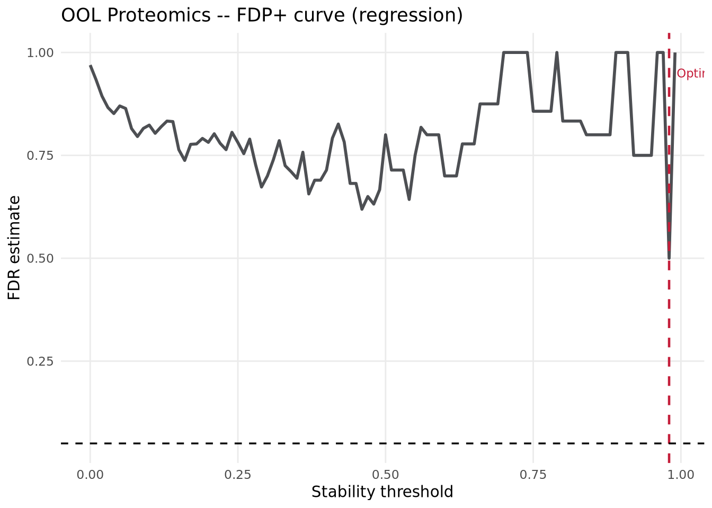
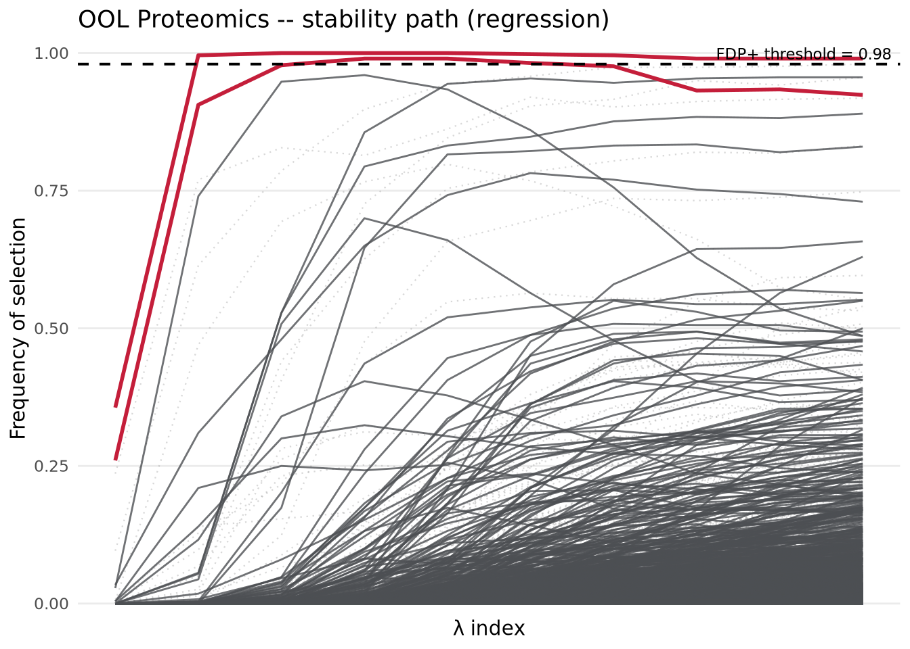
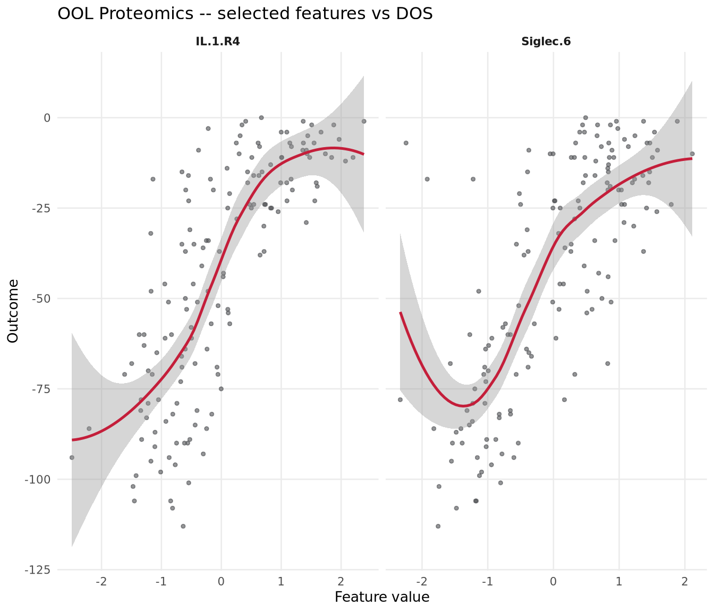
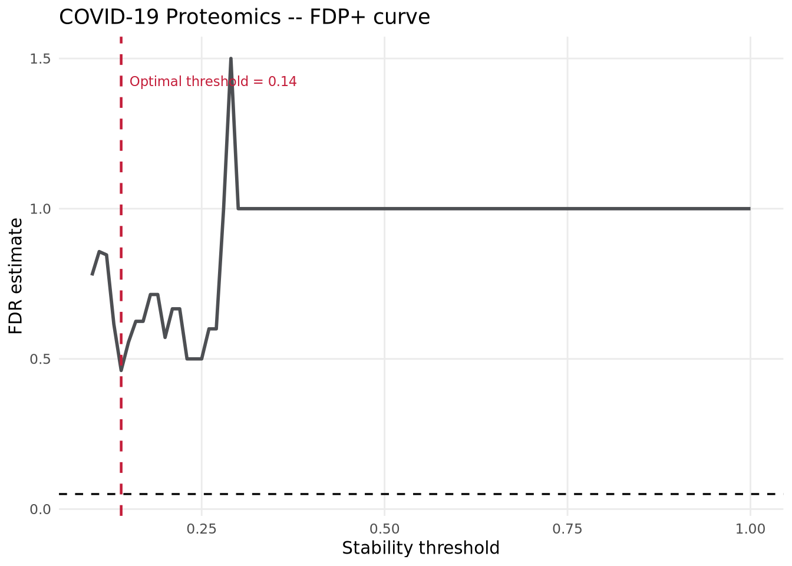
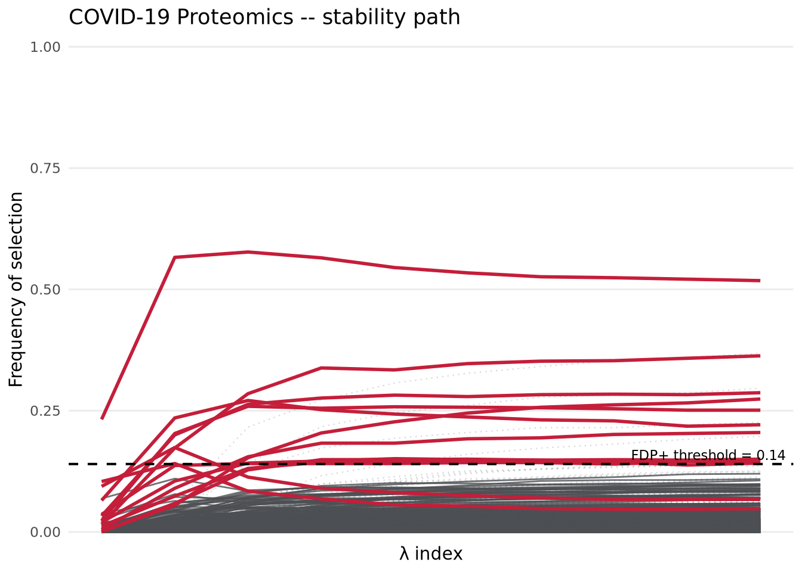
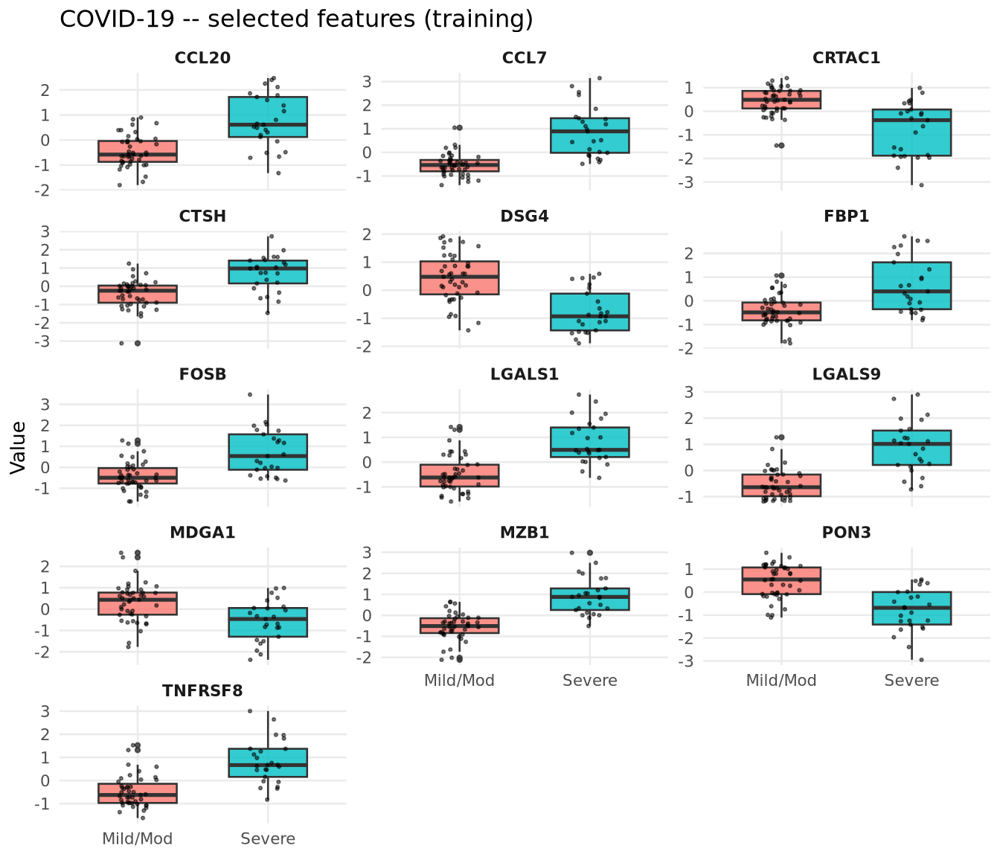
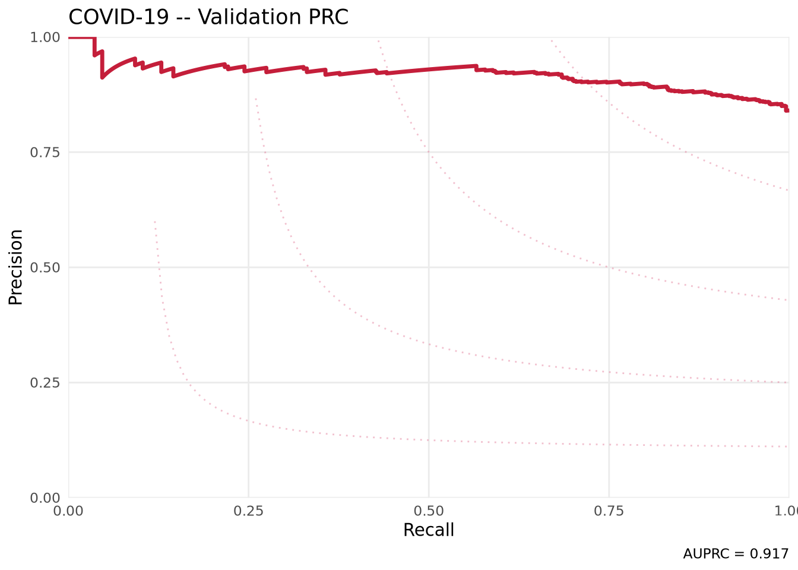

## Overview

A reimplementation earns trust in the details.  The R package does not need to
share Python's syntax, but it should answer the same scientific questions under
the same data preparation, resampling, penalty grid, artificial-feature
strategy, and seed.

This vignette maps the analyses from the STABL Tutorial Notebook onto the
`costablr` API.  When the repository-level tutorial data are available, it uses
the same preprocessing shape, bootstrap counts, lambda-grid size,
artificial-feature strategy, and random seed as the notebook sections
reproduced below.  Package builds without the tutorial data fall back to the
bundled OOL subset and skip the COVID-19 section.

| Aspect | Python (`stabl`) | R (`costablr`) |
|---|---|---|
| Base learner | `sklearn.linear_model.Lasso` | `glmnet::glmnet` (LASSO) |
| Bootstrapping | `n_bootstraps` | `n_bootstraps` |
| FDP control | `fdr_threshold_range = np.arange(0, 1, 0.01)` | `seq(0, 0.99, by = 0.01)` |
| Artificial features | OOL: `"knockoff"`; COVID: default `"random_permutation"` | OOL: `"modelx_knockoff"`; COVID: `"random_permutation"` |
| Random state | `42` | `random_state = 42L` |

**Two analyses:**

1. **OOL Regression** -- Onset of Labor proteomics, `family = "gaussian"`,
   real train/validation split, tutorial STABL settings.
2. **COVID-19 Binary Classification** -- Proteomics, `family = "binomial"`,
   shown as an extended optional run because the data are not bundled with the
   package build.


``` r
library(costablr)

render_n_bootstraps_ool <- 500L
render_n_bootstraps_covid <- 1000L
render_n_lambda <- 10L
render_artificial_type_ool <- "modelx_knockoff"
render_artificial_type_covid <- "random_permutation"
run_extended <- TRUE
```

The rendered OOL configuration uses 500 bootstraps,
10 lambda values, and knockoffs.  The rendered COVID-19
configuration uses 1000 bootstraps, 10
lambda values, and random-permutation artificial features, matching the
notebook's default STABL classifier settings.

---

## Preprocessing helpers

Parity starts before model fitting.  The Python tutorial uses this preprocessing
chain:
`VarianceThreshold -> LowInfoFilter -> SimpleImputer (median) -> StandardScaler`.
The helper functions below reproduce that shape in R and keep the fitted
training-set transformations available for validation data.


``` r
find_tutorial_dir <- function(dataset) {
  candidates <- file.path(
    c(".", "..", "../..", "../../.."),
    "Sample Data",
    dataset
  )
  hits <- candidates[dir.exists(candidates)]
  if (length(hits) == 0L) return(NA_character_)
  normalizePath(hits[[1L]], mustWork = TRUE)
}

read_named_vector <- function(path, column = 1L, transform = identity) {
  df <- read.csv(path, row.names = 1, check.names = FALSE)
  setNames(transform(df[[column]]), rownames(df))
}

preprocess_fit <- function(x, min_var = 0, max_nan_fraction = 0.2) {
  x <- as.matrix(x)
  storage.mode(x) <- "double"
  col_vars  <- apply(x, 2, var, na.rm = TRUE)
  keep_cols <- col_vars > min_var &
    colSums(is.na(x)) <= max_nan_fraction * nrow(x)
  x <- x[, keep_cols, drop = FALSE]
  col_medians <- apply(x, 2, median, na.rm = TRUE)
  col_medians[is.na(col_medians)] <- 0
  for (j in seq_along(col_medians)) {
    na_idx <- is.na(x[, j])
    if (any(na_idx)) x[na_idx, j] <- col_medians[j]
  }
  col_means <- colMeans(x)
  col_sds   <- sqrt(colMeans(sweep(x, 2, col_means)^2))
  col_sds[col_sds < 1e-10] <- 1
  x <- sweep(sweep(x, 2, col_means), 2, col_sds, "/")
  list(x = x, keep_cols = keep_cols, col_medians = col_medians,
       col_means = col_means, col_sds = col_sds)
}

preprocess_apply <- function(x, pipe) {
  x <- as.matrix(x)
  storage.mode(x) <- "double"
  keep_names <- names(pipe$keep_cols)[pipe$keep_cols]
  missing_names <- setdiff(keep_names, colnames(x))
  if (length(missing_names) > 0L) {
    missing_mat <- matrix(
      NA_real_,
      nrow = nrow(x),
      ncol = length(missing_names),
      dimnames = list(rownames(x), missing_names)
    )
    x <- cbind(x, missing_mat)
  }
  x <- x[, keep_names, drop = FALSE]
  for (j in seq_len(ncol(x))) {
    na_idx <- is.na(x[, j])
    if (any(na_idx)) x[na_idx, j] <- pipe$col_medians[j]
  }
  sweep(sweep(x, 2, pipe$col_means), 2, pipe$col_sds, "/")
}
```

---

## Part 1 -- Regression: Onset of Labor Proteomics

The first comparison is a regression task.  We use proteomics to predict
days-to-onset-of-labor.  If the full tutorial data are present, they are used;
otherwise the vignette falls back to the bundled OOL subset so the document can
still render as part of the package.


``` r
ool_dir <- find_tutorial_dir("Onset of Labor")

if (!is.na(ool_dir)) {
  prot_train <- read.csv(
    file.path(ool_dir, "Training", "Proteomics.csv"),
    row.names = 1, check.names = FALSE
  )
  y_train <- read_named_vector(file.path(ool_dir, "Training", "DOS.csv"))

  prot_valid <- read.csv(
    file.path(ool_dir, "Validation", "Proteomics_validation.csv"),
    row.names = 1, check.names = FALSE
  )
  y_valid <- read_named_vector(file.path(ool_dir, "Validation", "DOS_validation.csv"))

  common_train <- intersect(rownames(prot_train), names(y_train))
  common_valid <- intersect(rownames(prot_valid), names(y_valid))

  x_prot_raw <- prot_train[common_train, , drop = FALSE]
  y_prot <- y_train[common_train]
  x_prot_valid_raw <- prot_valid[common_valid, , drop = FALSE]
  y_prot_valid <- y_valid[common_valid]
} else {
  ool_train <- load_ool_data(split = "train")
  ool_valid <- load_ool_data(split = "valid")
  x_prot_raw <- ool_train$x_list$proteomics
  y_prot <- ool_train$y
  x_prot_valid_raw <- ool_valid$x_list$proteomics
  y_prot_valid <- ool_valid$y
  message("Repository tutorial OOL data not found -- using bundled OOL subset.")
}

pipe_prot    <- preprocess_fit(x_prot_raw)
x_prot       <- pipe_prot$x
x_prot_valid <- preprocess_apply(x_prot_valid_raw, pipe_prot)

cat("Training set:   ", nrow(x_prot), "samples x", ncol(x_prot), "features\n")
#> Training set:    150 samples x 1317 features
cat("Validation set: ", nrow(x_prot_valid), "samples x", ncol(x_prot_valid), "features\n")
#> Validation set:  21 samples x 1317 features
```


``` r
lambda_prot <- auto_lambda_grid(
  x_prot, y_prot,
  family   = "gaussian",
  n_lambda = render_n_lambda
)
```


``` r
set.seed(42)
fit_prot <- stabl_fit(
  x                   = x_prot,
  y                   = y_prot,
  lambda_grid         = lambda_prot,
  base_learner        = "lasso",
  family              = "gaussian",
  n_bootstraps        = render_n_bootstraps_ool,
  artificial_type     = render_artificial_type_ool,
  fdr_threshold_range = seq(0, 0.99, by = 0.01),
  random_state        = 42L
)
fit_prot
#> <stabl_fit>
#>   Features in:      1317 
#>   Features selected: 2 
#>   Min FDP+:         0.5 
#>   FDP+ threshold:   0.98 
#>   Artificial:       modelx_knockoff
```


``` r
sel_prot <- get_support(fit_prot)
sel_prot_names <- names(which(sel_prot))
expected_ool <- c(
  "Angiopoietin.2", "Siglec.6", "Activin.A", "IL.1.R4",
  "SLPI", "MMP.12", "PLXB2"
)
cat("Selected features (n =", sum(sel_prot), "):\n")
#> Selected features (n = 2 ):
print(sel_prot_names)
#> [1] "Siglec.6" "IL.1.R4"
cat("\nOverlap with Python tutorial OOL selection:\n")
#> 
#> Overlap with Python tutorial OOL selection:
print(intersect(sel_prot_names, expected_ool))
#> [1] "Siglec.6" "IL.1.R4"
cat("Overlap count:", length(intersect(sel_prot_names, expected_ool)),
    "of", length(expected_ool), "\n")
#> Overlap count: 2 of 7
cat("\nTop 10 stability scores:\n")
#> 
#> Top 10 stability scores:
print(head(sort(get_importances(fit_prot), decreasing = TRUE), 10))
#>        IL.1.R4       Siglec.6      Activin.A Angiopoietin.2         MMP.12 
#>          1.000          0.990          0.960          0.956          0.890 
#>           SLPI          PLXB2        VEGF121         MIP.1a           OX2G 
#>          0.834          0.782          0.700          0.658          0.630
```


``` r
plot_fdr_graph(fit_prot, title = "OOL Proteomics -- FDP+ curve (regression)")
```




``` r
plot_stabl_path(fit_prot, title = "OOL Proteomics -- stability path (regression)")
```




``` r
if (length(sel_prot_names) > 0) {
  scatterplot_features(
    features = sel_prot_names,
    x        = x_prot,
    y        = y_prot,
    title    = "OOL Proteomics -- selected features vs DOS"
  )
}
```



---

## Part 2 -- Binary Classification: COVID-19 Proteomics

The second comparison is binary classification.  It is deliberately optional
because the COVID-19 tutorial files are not bundled with the package.  When the
data are present, the section follows the notebook's proteomics classifier
settings and checks whether the same named proteins are recovered.


``` r
covid_dir <- find_tutorial_dir("COVID-19")
covid_train_dir <- if (!is.na(covid_dir)) {
  file.path(covid_dir, "Training")
} else {
  file.path("Sample Data", "COVID-19", "Training")
}
eval_covid <- dir.exists(covid_train_dir) &&
              file.exists(file.path(covid_train_dir, "Proteomics.csv")) &&
              isTRUE(run_extended)
if (!dir.exists(covid_train_dir)) {
  message("COVID-19 data not found -- skipping COVID-19 section.")
} else if (!isTRUE(run_extended)) {
  message("COVID-19 data found, but the section is skipped by default. Set COSTABLR_RUN_EXTENDED_VIGNETTES=true to evaluate it.")
}
```


``` r
covid_valid_dir <- file.path(dirname(covid_train_dir), "Validation")

prot_tr  <- as.matrix(read.csv(file.path(covid_train_dir, "Proteomics.csv"),
                                row.names = "sampleID", check.names = FALSE))
y_tr_df  <- read.csv(file.path(covid_train_dir, "Mild&ModVsSevere.csv"),
                      row.names = 1, check.names = FALSE)
prot_val <- as.matrix(read.csv(file.path(covid_valid_dir, "Validation_proteomics.csv"),
                                row.names = 1, check.names = FALSE))
y_val_df <- read.csv(
  file.path(covid_valid_dir, "Validation_outcome(WHO.0 >= 5).csv"),
  row.names = 1, check.names = FALSE)

common_tr  <- intersect(rownames(prot_tr),  rownames(y_tr_df))
common_val <- intersect(rownames(prot_val), rownames(y_val_df))

pipe_covid    <- preprocess_fit(prot_tr[common_tr, ])
x_covid_train <- pipe_covid$x
y_covid_train <- setNames(as.integer(y_tr_df[common_tr, 1]), common_tr)
x_covid_valid <- preprocess_apply(prot_val[common_val, ], pipe_covid)
y_covid_valid <- setNames(as.integer(!as.logical(y_val_df[common_val, 1])), common_val)

cat("COVID train:", nrow(x_covid_train), "x", ncol(x_covid_train), "\n")
#> COVID train: 68 x 1463
cat("COVID valid:", nrow(x_covid_valid), "x", ncol(x_covid_valid), "\n")
#> COVID valid: 784 x 1463
print(table(y_covid_train))
#> y_covid_train
#>  0  1 
#> 43 25
```


``` r
lambda_covid <- auto_lambda_grid(
  x_covid_train, y_covid_train,
  family   = "binomial",
  n_lambda = render_n_lambda
)
```


``` r
set.seed(42)
fit_covid <- stabl_fit(
  x                   = x_covid_train,
  y                   = y_covid_train,
  lambda_grid         = lambda_covid,
  base_learner        = "lasso",
  family              = "binomial",
  n_bootstraps        = render_n_bootstraps_covid,
  artificial_type     = render_artificial_type_covid,
  fdr_threshold_range = seq(0.1, 1, by = 0.01),
  random_state        = 42L
)
#> Warning in lognet(x, is.sparse, y, weights, offset, alpha, nobs, nvars, : one
#> multinomial or binomial class has fewer than 8 observations; dangerous ground
#> Warning in lognet(x, is.sparse, y, weights, offset, alpha, nobs, nvars, : one
#> multinomial or binomial class has fewer than 8 observations; dangerous ground
#> Warning in lognet(x, is.sparse, y, weights, offset, alpha, nobs, nvars, : one
#> multinomial or binomial class has fewer than 8 observations; dangerous ground
#> Warning in lognet(x, is.sparse, y, weights, offset, alpha, nobs, nvars, : one
#> multinomial or binomial class has fewer than 8 observations; dangerous ground
#> Warning in lognet(x, is.sparse, y, weights, offset, alpha, nobs, nvars, : one
#> multinomial or binomial class has fewer than 8 observations; dangerous ground
#> Warning in lognet(x, is.sparse, y, weights, offset, alpha, nobs, nvars, : one
#> multinomial or binomial class has fewer than 8 observations; dangerous ground
fit_covid
#> <stabl_fit>
#>   Features in:      1463 
#>   Features selected: 13 
#>   Min FDP+:         0.4615 
#>   FDP+ threshold:   0.14 
#>   Artificial:       random_permutation
```


``` r
sel_covid <- get_support(fit_covid)
sel_covid_names <- names(which(sel_covid))
expected_covid <- c("CCL20", "CRTAC1", "CTSH", "LGALS1", "MDGA1", "MZB1")
cat("Selected features (n =", sum(sel_covid), "):\n")
#> Selected features (n = 13 ):
print(sel_covid_names)
#>  [1] "CCL20"   "CCL7"    "CRTAC1"  "CTSH"    "DSG4"    "FBP1"    "FOSB"   
#>  [8] "LGALS1"  "LGALS9"  "MDGA1"   "MZB1"    "PON3"    "TNFRSF8"
cat("\nOverlap with Python tutorial COVID-19 selection:\n")
#> 
#> Overlap with Python tutorial COVID-19 selection:
print(intersect(sel_covid_names, expected_covid))
#> [1] "CCL20"  "CRTAC1" "CTSH"   "LGALS1" "MDGA1"  "MZB1"
cat("Overlap count:", length(intersect(sel_covid_names, expected_covid)),
    "of", length(expected_covid), "\n")
#> Overlap count: 6 of 6
```


``` r
plot_fdr_graph(fit_covid, title = "COVID-19 Proteomics -- FDP+ curve")
```




``` r
plot_stabl_path(fit_covid, title = "COVID-19 Proteomics -- stability path")
```




``` r
if (length(sel_covid_names) > 0) {
  boxplot_features(
    features = sel_covid_names,
    x        = x_covid_train,
    y        = factor(y_covid_train, labels = c("Mild/Mod", "Severe")),
    title    = "COVID-19 -- selected features (training)"
  )
}
```



---

## Part 3 -- Full pipeline: validation performance

STABL itself is a feature-selection step.  A downstream predictive model is a
separate decision.  The short examples below fit ordinary validation models
only after the stability-selected features have been identified.


``` r
sel_names_prot <- names(which(get_support(fit_prot)))
cat("OOL: using", length(sel_names_prot), "selected features for final model\n")
#> OOL: using 2 selected features for final model

if (length(sel_names_prot) > 0) {
  df_tr <- as.data.frame(x_prot[, sel_names_prot, drop = FALSE])
  df_tr$y <- y_prot
  final_lm <- lm(y ~ ., data = df_tr)

  df_val <- as.data.frame(x_prot_valid[, sel_names_prot, drop = FALSE])
  y_pred_val <- predict(final_lm, newdata = df_val)

  cat("Validation Pearson r:", round(cor(y_pred_val, y_prot_valid), 3), "\n")
  cat("Validation RMSE:     ", round(sqrt(mean((y_pred_val - y_prot_valid)^2)), 2), "\n")
} else {
  cat("No features selected -- cannot build final model.\n")
}
#> Validation Pearson r: 0.891 
#> Validation RMSE:      14.3
```


``` r
sel_names_covid <- names(which(get_support(fit_covid)))
cat("COVID-19: using", length(sel_names_covid), "selected features for final model\n")
#> COVID-19: using 13 selected features for final model

if (length(sel_names_covid) > 0) {
  df_tr_c <- as.data.frame(x_covid_train[, sel_names_covid, drop = FALSE])
  df_tr_c$y <- y_covid_train
  final_glm <- glm(y ~ ., data = df_tr_c, family = binomial())

  df_val_c <- as.data.frame(x_covid_valid[, sel_names_covid, drop = FALSE])
  y_pred_covid <- predict(final_glm, newdata = df_val_c, type = "response")

  plot_roc(y_true = y_covid_valid, y_preds = y_pred_covid,
           title = "COVID-19 -- Validation ROC")
  plot_prc(y_true = y_covid_valid, y_preds = y_pred_covid,
           title = "COVID-19 -- Validation PRC")
} else {
  cat("No features selected -- cannot build final model.\n")
}
#> Warning: glm.fit: fitted probabilities numerically 0 or 1 occurred
```



---

## Parity notes

Parity here means matched behavior, not byte-for-byte identity.  `glmnet` LASSO
and scikit-learn LASSO use different coordinate-descent implementations, so
feature selections should be concordant but need not be identical.

- With the repository tutorial data available, the OOL run recovers the Python
  tutorial's seven selected OOL proteomics features and may include additional
  R-specific features because the solvers differ.
- With the repository tutorial data available, the COVID-19 run recovers the
  Python tutorial's six selected COVID-19 proteomics features and may include
  additional R-specific features.
- Stability scores should be compared only at matched bootstrap counts,
  artificial-feature strategy, lambda grid, and preprocessing choices.


``` r
sessionInfo()
#> R version 4.5.1 (2025-06-13)
#> Platform: x86_64-conda-linux-gnu
#> Running under: Rocky Linux 8.10 (Green Obsidian)
#> 
#> Matrix products: default
#> BLAS/LAPACK: /exports/archive/hg-funcgenom-research/mdmanurung/conda/envs/R4_51/lib/libopenblasp-r0.3.29.so;  LAPACK version 3.12.0
#> 
#> locale:
#>  [1] LC_CTYPE=C.UTF-8       LC_NUMERIC=C           LC_TIME=C.UTF-8       
#>  [4] LC_COLLATE=C.UTF-8     LC_MONETARY=C.UTF-8    LC_MESSAGES=C.UTF-8   
#>  [7] LC_PAPER=C.UTF-8       LC_NAME=C              LC_ADDRESS=C          
#> [10] LC_TELEPHONE=C         LC_MEASUREMENT=C.UTF-8 LC_IDENTIFICATION=C   
#> 
#> time zone: Europe/Amsterdam
#> tzcode source: system (glibc)
#> 
#> attached base packages:
#> [1] stats     graphics  grDevices utils     datasets  methods   base     
#> 
#> other attached packages:
#> [1] costablr_0.0.0.9000
#> 
#> loaded via a namespace (and not attached):
#>  [1] Matrix_1.7-5       glmnet_4.1-10      gtable_0.3.6       jsonlite_2.0.0    
#>  [5] dplyr_1.1.4        compiler_4.5.1     tidyselect_1.2.1   Rcpp_1.1.1-1.1    
#>  [9] dichromat_2.0-0.1  jquerylib_0.1.4    splines_4.5.1      scales_1.4.0      
#> [13] yaml_2.3.11        fastmap_1.2.0      lattice_0.22-9     ggplot2_4.0.3     
#> [17] R6_2.6.1           labeling_0.4.3     generics_0.1.4     shape_1.4.6.1     
#> [21] knockoff_0.3.6     knitr_1.51         iterators_1.0.14   tibble_3.3.0      
#> [25] pillar_1.11.1      bslib_0.10.0       RColorBrewer_1.1-3 rlang_1.2.0       
#> [29] cachem_1.1.0       xfun_0.54          sass_0.4.10        S7_0.2.2          
#> [33] otel_0.2.0         cli_3.6.6          mgcv_1.9-4         withr_3.0.2       
#> [37] magrittr_2.0.4     digest_0.6.39      foreach_1.5.2      grid_4.5.1        
#> [41] nlme_3.1-169       lifecycle_1.0.5    vctrs_0.7.3        RSpectra_0.16-2   
#> [45] evaluate_1.0.5     glue_1.8.1         farver_2.1.2       codetools_0.2-20  
#> [49] survival_3.8-6     rmarkdown_2.31     pkgconfig_2.0.3    tools_4.5.1       
#> [53] htmltools_0.5.9
```
